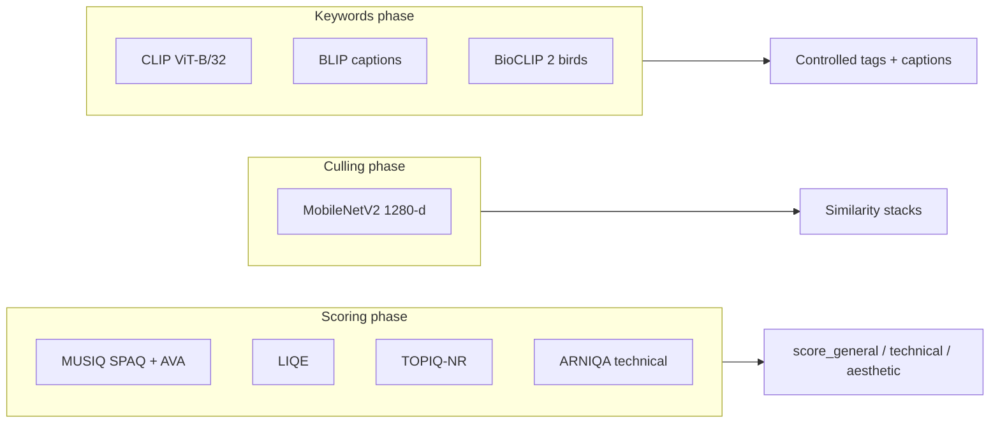
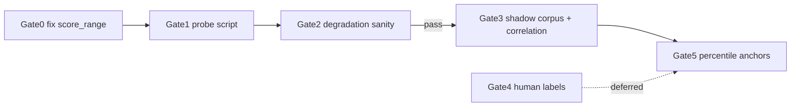

# New Models — Summary

Consolidated overview of **new and roadmap** ML models documented under `docs/`. For live production behavior see [technical/MODELS_SUMMARY.md](technical/MODELS_SUMMARY.md); for the full phased roadmap see [MODEL_RECOMMENDATIONS_PIPELINES.md](MODEL_RECOMMENDATIONS_PIPELINES.md) (issue [#220](https://github.com/synthet/image-scoring-backend/issues/220)).

**Target hardware assumption (roadmap):** RTX 4060 Laptop, 8 GB VRAM — permissive licenses preferred, English-only prompts.

---

## Context

The model documentation splits into three layers:

| Layer | Key docs | Role |
|-------|----------|------|
| **Production reference** | [technical/MODELS_SUMMARY.md](technical/MODELS_SUMMARY.md), [features/implemented/02-scoring-and-models.md](features/implemented/02-scoring-and-models.md) | What runs today |
| **Canonical roadmap** | [MODEL_RECOMMENDATIONS_PIPELINES.md](MODEL_RECOMMENDATIONS_PIPELINES.md) | Phased additions for scoring, culling, keywords |
| **Research + proposals** | [planning/models/IQA_MODEL_STACK_UPDATE_PROPOSAL.md](planning/models/IQA_MODEL_STACK_UPDATE_PROPOSAL.md), [reports/CLIP_MODELS_CULLING_SCORING_2026-05-23.md](reports/CLIP_MODELS_CULLING_SCORING_2026-05-23.md), [planning/models/QPT_V2_VALIDATION_GATES.md](planning/models/QPT_V2_VALIDATION_GATES.md) | Stack modernization, CLIP research, QPT validation |

---

## Production today (baseline)

From [MODEL_RECOMMENDATIONS_PIPELINES.md](MODEL_RECOMMENDATIONS_PIPELINES.md) and [technical/MODELS_SUMMARY.md](technical/MODELS_SUMMARY.md):

| Pipeline | Models | Notes |
|----------|--------|-------|
| **Scoring** | MUSIQ (SPAQ, AVA), LIQE, TOPIQ-NR, **ARNIQA** | Fused into composites; KONIQ/PAQ2PIQ deprecated from registry. ARNIQA promoted from shadow (May 2026) into general+technical |
| **Scoring (disabled)** | QPT-V2 | Reconstructed HiViT-T; **not registered** until validation (#185) |
| **Culling** | MobileNetV2 ImageNet GAP | Default embedding space `mobilenet_v2_imagenet_gap` |
| **Keywords** | CLIP B/32, BLIP, BioCLIP 2 | CLIP for tags; BLIP for captions; BioCLIP for bird species |

---

## New / roadmap models (by pipeline)

### Scoring — ARNIQA (production — fused)

- **What:** No-reference IQA (distortion-focused), Apache-2.0, PyTorch (via `pyiqa`)
- **Role:** Technical quality signal — blur, noise, compression
- **Posture:** **Promoted to fusion (May 2026)** after full-corpus backfill + calibration.
  Config `scoring.models.arniqa: {enabled: true, shadow: false}`.
- **Fusion:** contributes to **general** (0.10) and **technical** (0.25); intentionally
  **not** in aesthetic (Spearman ≈0.01 vs AVA). Anchors `p02≈0.467 / p98≈0.746`.
- **Head:** pyiqa default `arniqa` (KonIQ head); switchable via `scoring.arniqa.metric`
- **Modules:** `modules/arniqa.py` + `modules/engines/arniqa_model.py`
- **Phase:** 2 in [#220](https://github.com/synthet/image-scoring-backend/issues/220) — **done (promoted to production)**

### Scoring — QPT-V2 (exists in code, not promoted)

Two docs describe different futures for QPT-V2:

| Doc | Stance |
|-----|--------|
| [planning/models/IQA_MODEL_STACK_UPDATE_PROPOSAL.md](planning/models/IQA_MODEL_STACK_UPDATE_PROPOSAL.md) | **Anchor model** — 55% general, 75% aesthetic, retire AVA/KONIQ/SPAQ |
| [MODEL_RECOMMENDATIONS_PIPELINES.md](MODEL_RECOMMENDATIONS_PIPELINES.md) | **Not default now** — shadow/research until gates pass |

**Current reality** ([planning/models/QPT_V2_VALIDATION_GATES.md](planning/models/QPT_V2_VALIDATION_GATES.md), [planning/models/CALIBRATION_LAYER_185_STATUS.md](planning/models/CALIBRATION_LAYER_185_STATUS.md)):

- Checkpoint loads (172/172 tensors); raw scores ~`[-0.25, 0]`, not 0–1
- Directionally sensitive to blur (Spearman −0.81 with center-crop preprocess)
- Upstream inference recipe incomplete; community reports unsatisfactory scores
- Known bug: `score_range = (0.0, 1.0)` causes shadow `normalized` values to clamp to 0
- **Do not fuse** until Gates 1–3, 5 pass (+ deferred Gate 4 human labels)

### Culling — DINOv2-reg base (recommended default target)

- **What:** Self-supervised ViT embeddings — visual similarity without text alignment
- **Role:** Replace MobileNetV2 as **default** culling space after validation
- **Keep:** MobileNet + existing CLIP vectors as fallback during backfill
- **Phase:** 3 in #220

### Culling — CLIP B/32 interim (Phase 1)

- **What:** Reuse already-persisted `clip_vit_b32_image` (512-d) via `clustering.embedding_space`
- **Role:** Quick win — switch culling input without loading a new model
- **Caveat:** Re-tune `clustering.default_threshold` and sub-cluster thresholds

### Keywords — SigLIP2 base (recommended production target)

- **What:** Image–text model with per-pair sigmoid scoring (Apache-2.0)
- **Role:** Controlled taxonomy tags with **independent per-tag thresholds** (not softmax-over-set)
- **Phase:** 4 in #220 — shadow → production default; CLIP/BLIP kept behind config

### Keywords — RAM++ (optional shadow)

- **Role:** Open-vocabulary tag **discovery** only — suggest tags outside controlled taxonomy
- **Not** the default metadata writer

### Optional unified CLIP track (Phase 5 / A-B)

**OpenCLIP ViT-L/14** (`laion2b_s32b_b82k`, MIT): one 768-d tower for both culling similarity and keyword zero-shot on 8 GB VRAM.

Optional scoring add-ons (shadow only):

- **LAION aesthetic predictor** — MLP on L/14 embeddings
- **CLIP prompt margin** — positive minus weighted negative prompts

**When to pick OpenCLIP L/14 vs DINOv2 + SigLIP2:**

| Track | Best when |
|-------|-----------|
| DINOv2 + SigLIP2 (default roadmap) | Permissive license, culling without text bias, controlled keywords |
| OpenCLIP L/14 unified | Minimize distinct GPU models, English-only, A/B shows DINO false-splits |

---

## Models explicitly not recommended as defaults

| Model | Reason |
|-------|--------|
| **Q-Align** | Large MLLM; too heavy/slow for 8 GB laptop default |
| **QPT-V2** | Until validation gates pass (despite strong paper SRCC ~0.865 on AVA) |
| **QualiCLIP** | Strong IQA but CC-BY-NC license |
| **Florence-2** | Better for captions/open-vocab than controlled keyword taxonomy |
| **MetaCLIP ViT-H/14** | NC license; ViT-H too large for 8 GB co-load |
| **Raw CLIP as IQA** | CLIP report: good for semantic ranking, **not** drop-in for MUSIQ/LIQE/TOPIQ aesthetic/technical IQA |

---

## Calibration layer (#185)

[planning/models/CALIBRATION_LAYER_185_STATUS.md](planning/models/CALIBRATION_LAYER_185_STATUS.md) tracks making new model scores comparable before fusion:

| Deliverable | Status |
|-------------|--------|
| TOPIQ percentile anchors (`p02≈0.39`, `p98≈0.71`) | Done |
| QPT-V2 percentile anchors | Blocked — needs validated shadow corpus |
| Percentile rescaling (`rescale_percentile`) | Done |
| Z-score normalization | Blocked — needs corpus DB online |
| Isotonic / logistic | Blocked — needs human preference labels |

QPT-V2 validation gates ([planning/models/QPT_V2_VALIDATION_GATES.md](planning/models/QPT_V2_VALIDATION_GATES.md)):

---

## Implementation phases (#220)

| Phase | Scope | New model? |
|-------|--------|------------|
| **0** | Docs + CLIP report ingest | No |
| **1** | Culling reads `clip_vit_b32_image`; threshold harness | No new loader |
| **2** | ARNIQA shadow → `image_model_scores` ✅ done | Yes |
| **3** | DINOv2 space, backfill, culling default | Yes |
| **4** | SigLIP2 keyword scorer shadow → production | Yes |
| **5** | Optional OpenCLIP L/14 unified track if A/B wins | Yes |

---

## Key design principles (from docs)

1. **Specialists, not monoliths** — DINOv2/OpenCLIP for grouping; ARNIQA/LAION/ensemble for scoring; SigLIP2/RAM++ for keywords
2. **Shadow before production** — persist to `image_model_scores` without changing fusion/stacks/tags
3. **Re-tune thresholds** when embedding space changes (MobileNet-tuned values do not transfer)
4. **CLIP scoring rules** (from CLIP report): L2-normalized cosine; positive+negative prompt banks; softmax only within closed candidate sets
5. **Two stack visions coexist** — IQA proposal centers QPT-V2; pipeline roadmap is more conservative and adds ARNIQA/DINOv2/SigLIP2 first

---

## Doc index (models)

| Document | Topic |
|----------|-------|
| [MODEL_RECOMMENDATIONS_PIPELINES.md](MODEL_RECOMMENDATIONS_PIPELINES.md) | **Start here** — canonical phased roadmap |
| [technical/MODELS_SUMMARY.md](technical/MODELS_SUMMARY.md) | Live production models |
| [planning/models/QPT_V2_VALIDATION_GATES.md](planning/models/QPT_V2_VALIDATION_GATES.md) | QPT promotion criteria |
| [planning/models/CALIBRATION_LAYER_185_STATUS.md](planning/models/CALIBRATION_LAYER_185_STATUS.md) | #185 blockers |
| [planning/models/IQA_MODEL_STACK_UPDATE_PROPOSAL.md](planning/models/IQA_MODEL_STACK_UPDATE_PROPOSAL.md) | QPT-centric stack modernization |
| [reports/CLIP_MODELS_CULLING_SCORING_2026-05-23.md](reports/CLIP_MODELS_CULLING_SCORING_2026-05-23.md) | CLIP-family research |
| [planning/INDEX.md](planning/INDEX.md) | Planning hub with model section |
