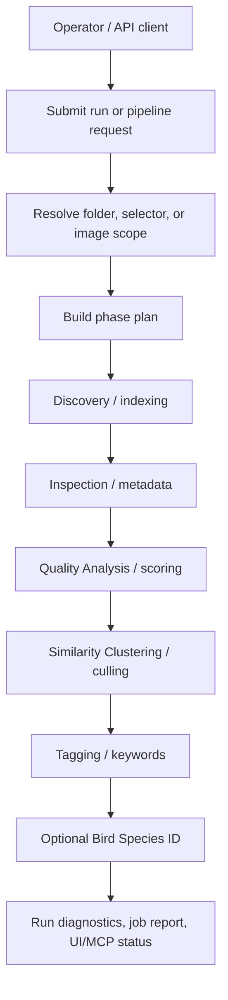

# Pipeline Architecture

This page summarizes the backend image pipeline. For exact phase codes and UI labels, use [../technical/PIPELINE_TERMINOLOGY.md](../technical/PIPELINE_TERMINOLOGY.md).

## Phase Sequence

| Phase code | Submit token | User label | Responsibility |
|---|---|---|---|
| `indexing` | `indexing` | Discovery | Scan and register files. |
| `metadata` | `metadata` | Inspection | Extract EXIF/XMP, image dimensions, thumbnails, and related metadata. |
| `scoring` | `score` | Quality Analysis | Run quality models and persist scores. |
| `culling` | `cluster` | Similarity Clustering | Build similarity groups/stacks. |
| `keywords` | `tag` | Tagging | Generate keywords/captions and sync metadata. |
| `bird_species` | Not confirmed in current docs/code as a standard submit token; check [../technical/PIPELINE_TERMINOLOGY.md](../technical/PIPELINE_TERMINOLOGY.md). | Bird Species ID | Optional post-tagging classifier path. |

## Run Model

- Batch work is persisted in `jobs`.
- Per-run phase rows live in `job_phases`.
- Per-image phase status lives in `image_phase_status`.
- The React Runs UI and gallery copy generally call a `jobs.id` row a **run**.
- Queue and restart behavior is documented in [../technical/RUNS_QUEUE_AND_RESTART.md](../technical/RUNS_QUEUE_AND_RESTART.md).

## High-Level Flow

## Storage And Status

PostgreSQL + pgvector is the primary data layer. The backend owns schema and migrations; the gallery consumes schema through PostgreSQL or backend API mode. See [../DATABASE.md](../DATABASE.md), [../technical/DB_SCHEMA.md](../technical/DB_SCHEMA.md), and [../technical/AGENT_COORDINATION.md](../technical/AGENT_COORDINATION.md).

## API Surfaces

- Runs and queue: `/api/runs/*`, `/api/queue`, `/api/jobs/*`.
- Pipeline compatibility surface: `/api/pipeline/*`.
- Scoring/tagging/clustering runner surfaces: `/api/scoring/*`, `/api/tagging/*`, `/api/clustering/*`.
- Canonical contract: [../technical/API_CONTRACT.md](../technical/API_CONTRACT.md), [../reference/api/openapi.yaml](../reference/api/openapi.yaml).

## Related

- [../IMAGE_PIPELINE.md](../IMAGE_PIPELINE.md)
- [../features/implemented/01-pipeline-and-runs.md](../features/implemented/01-pipeline-and-runs.md)
- [../technical/PIPELINE_PHASE_RUNNERS.md](../technical/PIPELINE_PHASE_RUNNERS.md)
