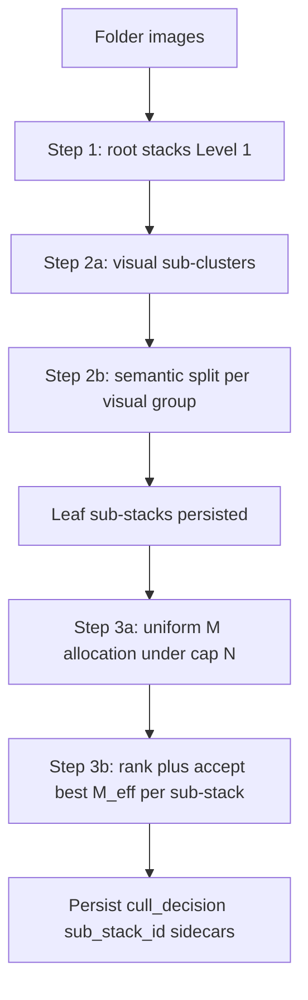

# Two-level culling

> **Status:** Spec + backend implementation (feature flag `culling.two_level.enabled`, default off).
> **Related:** [Culling model recommendation](../../../reports/CULLING_MODEL_RECOMMENDATION_2026-05-29.md) · [#220 Pipeline model upgrades](https://github.com/synthet/image-scoring-backend/issues/220)

## Problem

A single flat pick/reject band across an entire stack rejects diverse lower-scored frames the photographer wants (e.g. three bird poses in one burst). Today, in-memory sub-clustering ([`modules/sub_clustering.py`](../../../../modules/sub_clustering.py)) applies a 33/33 band per micro-group but does not persist sub-stacks or cap total accepts.

## Goal

Within each root **stack**:

1. Split images into **sub-stacks** diverse both **visually** and **semantically** (sequential two-pass clustering).
2. Accept the best **M** images per sub-stack (default **3**).
3. Cap total accepts at **N** per stack (default **20**); reduce **M** uniformly when `num_substacks × M > N`.
4. Use configurable embedding space + threshold per step.

## Algorithm



### Step 1 — root stacks (Level 1)

Reuse `ClusteringEngine.cluster_images()`. Space/threshold from `culling.two_level.level1.*` (defaults mirror `clustering.default_threshold` + MobileNet).

### Step 2 — sub-stacks (single pass, one model)

For each root stack with ≥2 images:

1. **Sub-clustering pass:** `compute_sub_clusters(group, emb_level2, threshold=level2.distance_threshold)` using one embedding space.
2. **Leaves** = the resulting groups. Missing embeddings → fallback bucket (existing safety in `compute_sub_clusters`).

Persist each leaf as a `sub_stacks` row; set `images.sub_stack_id`.

> Earlier revisions ran a sequential visual→semantic two-pass. That collapsed to a
> single pass with one model (the [2026-05-29 review](../../../reports/CULLING_MODEL_RECOMMENDATION_2026-05-29.md#evidence-2026-05-29-pickreject-visual-review-two-level)
> validated single-pass L/14 and found no benefit from a second model pass). The
> `sub_stacks.level2_semantic_space` column is retained but written `NULL`.

### Step 3 — accept/reject (best-M, capped, uniform)

Per root stack:

- `M = picks_per_substack` (3), `N = max_picks_per_stack` (20), `c = num_leaf_substacks`.
- `M_eff = min(M, max(1, floor(N / c)))`.
- `leftover = N - M_eff × c`; distribute one extra slot to largest sub-stacks (tie: highest top score), capped at `M` and sub-stack size.
- Within each sub-stack: sort by `score_general` + EXIF tie-break; optional MMR diversity reorder. Top slots → `pick`; remainder → `reject` (if `reject_non_picks`) or `neutral`. Singletons → `neutral`.

## Data model

| Table / column | Purpose |
|----------------|---------|
| `sub_stacks` | First-class leaf sub-stack; FK `stack_id` → `stacks.id` |
| `sub_stacks.best_image_id` | Top-ranked image in sub-stack |
| `sub_stacks.level1_space` / `level2_visual_space` | Audit of spaces used (`level2_visual_space` = the single level-2 space; `level2_semantic_space` retained but NULL) |
| `images.sub_stack_id` | FK → `sub_stacks.id` ON DELETE SET NULL |

Migration: `migrations/versions/0028_sub_stacks.py`.

## Config

| Key | Default | Description |
|-----|---------|-------------|
| `culling.two_level.enabled` | `false` | Master switch |
| `culling.two_level.picks_per_substack` | `3` | Target M |
| `culling.two_level.max_picks_per_stack` | `20` | Cap N |
| `culling.two_level.reject_non_picks` | `true` | Non-picks → reject vs neutral |
| `culling.two_level.level1.embedding_space` | `mobilenet_v2_imagenet_gap` | Root stack space (future: DINOv2) |
| `culling.two_level.level1.distance_threshold` | `0.15` | Root stack threshold |
| `culling.two_level.level2.embedding_space` | `openclip_l14_laion2b_image` | Sub-stacking space — one model (requires backfill — see below) |
| `culling.two_level.level2.distance_threshold` | `0.06` | OpenCLIP L/14 tuned (exp8) |
| `culling.two_level.diversity.enabled` | `true` | MMR within sub-stack picks |
| `culling.two_level.diversity.lambda` | `0.70` | MMR λ |

When `enabled=false`, `SelectionService` uses legacy single-pass sub-clustering + 33/33 bands.

> **Documented default = single `openclip_l14_laion2b_image` pass @ 0.06.** The
> [2026-05-29 pick/reject review](../../../reports/CULLING_MODEL_RECOMMENDATION_2026-05-29.md#evidence-2026-05-29-pickreject-visual-review-two-level)
> validated single-pass L/14 (keeps higher-rated near-dups than MobileNet) and found
> no benefit from a second model pass, so sub-stacking is one model / one threshold.
>
> **Prerequisite:** these vectors are not generated by default — run
> `alembic upgrade head` and
> `python -m scripts.backfill_culling_embeddings --space openclip_l14_laion2b_image`
> first (the example lists it in `embeddings.culling_spaces`). Without the vectors,
> `compute_leaf_substacks` safely falls back to a single bucket (no sub-split).
> The `0.06` threshold is exp8 *root-grouping*-tuned — sweep it for *within-stack*
> sub-stacking before enabling by default. `level1` stays MobileNet (root stacks come
> from the clustering phase, and `level1` is audit-only here).

## Selectable embedding spaces (integrating new culling models)

`level1.embedding_space` and `level2.embedding_space` accept any **registered** space
code; the pipeline reads vectors via `db.get_image_embeddings_batch_for_space`.
`mobilenet_v2_imagenet_gap` (and `clip_vit_b32_image`) are the only ones populated
for every library out of the box. The optional 768-d culling towers from the
[2026-05-29 spike](../../../reports/CULLING_MODEL_RECOMMENDATION_2026-05-29.md)
are **registered but not generated by default**:

| Space code | Model | Verdict | Best threshold (exp8) |
|------------|-------|---------|-----------------------|
| `openclip_l14_laion2b_image` | OpenCLIP ViT-L/14 `laion2b_s32b_b82k` | A/B (best grouping ARI 0.450) | 0.06 |
| `openai_clip_vit_l14_image` | OpenAI CLIP ViT-L/14 | INFO | 0.06 |
| `siglip2_base_image` | SigLIP2 base patch16-224 | INFO (mid-pack 0.432) | 0.04 |
| `dinov2_reg_base_image` | DINOv2-reg base (timm proxy) | HOLD (0.377 < MobileNet) | 0.12 |

**To use one in two-level culling:**

1. **Register** (one-time): `alembic upgrade head` (migration `0029` seeds the
   registry rows; fresh DBs also get them from `_SEED_EXTRA_EMBEDDING_SPACES_SQL`).
2. **Generate** the vectors. Add the code to `embeddings.culling_spaces`, then
   backfill existing images (WSL, `~/.venvs/tf`):
   ```bash
   python -m scripts.backfill_culling_embeddings --space openclip_l14_laion2b_image
   ```
   Loaders live in [`modules/embedding_extractors.py`](../../../../modules/embedding_extractors.py)
   (`SUPPORTED_CULLING_SPACES`). Without vectors, `compute_leaf_substacks` falls
   back to a single-bucket leaf (no error, no sub-split).
3. **Point `level2`** at the code and **re-tune its threshold** (do not reuse the
   MobileNet default — thresholds do not transfer across spaces):
   ```json
   "level2": { "embedding_space": "openclip_l14_laion2b_image", "distance_threshold": 0.06 }
   ```

`sub_stacks.level1_space` / `level2_visual_space` record which spaces produced each
leaf for audit (`level2_semantic_space` is retained but written NULL).

## API

| Method | Path | Description |
|--------|------|-------------|
| GET | `/api/stacks/{stack_id}/substacks` | Sub-stacks for a root stack |
| — | Image rows | Include `sub_stack_id` where set |

## Modules

| Module | Role |
|--------|------|
| [`modules/two_level_culling.py`](../../../../modules/two_level_culling.py) | `compute_leaf_substacks`, `allocate_picks_uniform` |
| [`modules/selection_policy.py`](../../../../modules/selection_policy.py) | `classify_best_m` |
| [`modules/selection.py`](../../../../modules/selection.py) | Orchestration when flag enabled |

## Testing

- Unit: `tests/test_two_level_culling.py`, extend `tests/test_sub_clustering.py`.
- Postgres E2E: sub_stack persistence, `sum(picks) <= N` per stack.

## Gallery (cross-repo)

Backend is additive. Gallery should read `sub_stack_id` and group under root stacks — see sibling `image-scoring-gallery` `electron/db.ts`.

## Threshold tuning

Re-use [`scripts/research/clip_culling/`](../../../../scripts/research/clip_culling/) to sweep `level2_visual` / `level2_semantic` thresholds before enabling by default.
