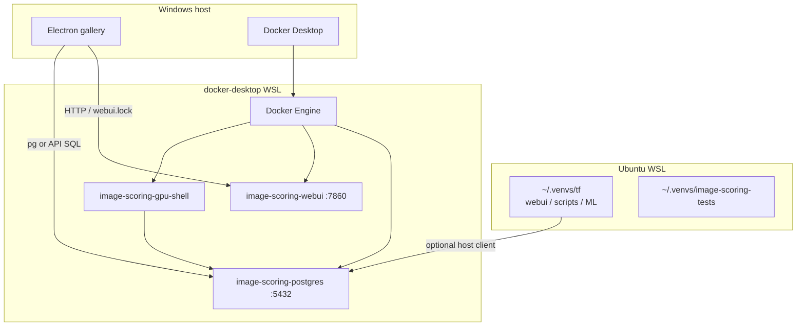

# WSL vs Docker topology

On Windows, this project uses **two WSL2 distros** plus the Windows host. They are not interchangeable. Day-to-day scoring + Postgres + **GPU scripts/research** can run entirely under Docker (`db` / `webui` / `gpu-shell`). Ubuntu WSL remains optional for host Python and `pytest -m wsl`. Electron gallery stays on Windows.

Related: [ENVIRONMENTS.md](ENVIRONMENTS.md) (Python venvs), [DOCKER_SETUP.md](DOCKER_SETUP.md) (compose build/run, GPU shell), [WINDOWS_WSL_DEPLOYMENT.md](WINDOWS_WSL_DEPLOYMENT.md). Disk reclaim when sunsetting Ubuntu: [below](#sunsetting-ubuntu--disk-reclaim).

## Distro map

| Layer | Typical identity | Role |
|-------|------------------|------|
| **Ubuntu** | Default WSL distro; disk often under `D:\WSL\Ubuntu\ext4.vhdx` | Optional host for `~/.venvs/tf`, `~/.venvs/image-scoring-tests`, `run_webui.bat` when not using Docker |
| **docker-desktop** | Managed by Docker Desktop | Docker Engine → Compose (`image-scoring-postgres`, `image-scoring-webui`, **`image-scoring-gpu-shell`**, e2e profiles) |
| **Windows host** | Native | Electron gallery (**image-scoring-gallery**), Docker Desktop UI, PowerShell wrappers |



**Check state:** `wsl.exe -l -v` — Ubuntu and `docker-desktop` list separately (`Running` / `Stopped`).

## Operator decision table

| Goal | Enough to run | Notes |
|------|---------------|-------|
| Postgres only | `docker compose up -d db` (or keep `image-scoring-postgres` up) | Ubuntu may stay **Stopped** |
| Scoring WebUI + DB (Docker-first) | `image-scoring-postgres` + `image-scoring-webui` | Ubuntu optional; GPU via NVIDIA Container Toolkit / Desktop GPU |
| Scoring WebUI (WSL-first) | Ubuntu + `~/.venvs/tf` via `run_webui.bat` | Still needs Postgres (usually Docker) |
| Ad-hoc scripts / `modules.*` / research / student scorer | **`gpu-shell`** (Compose profile) | Prefer over Ubuntu; see [DOCKER_SETUP — GPU shell](DOCKER_SETUP.md#gpu-shell-scripts--research). Ubuntu + `~/.venvs/tf` still works |
| Official `pytest -m wsl` | Ubuntu + `~/.venvs/image-scoring-tests` | See [WSL Tests](../../testing/WSL_TESTS.md) |
| Docker inference E2E | Compose profile `e2e-inference` | Separate from Postgres API E2E; see AGENTS.md |
| Browse / cull in desktop UI | **Windows** Electron gallery | Gallery Compose image exists but is secondary; prefer `npm run dev` |
| “Everything in Docker only” | **Not** full product (gallery + Docker Engine WSL remain) | Scripts/research **can** use `gpu-shell` without Ubuntu |

## Can Ubuntu stay stopped?

**Yes**, when you only need Compose Postgres, `image-scoring-webui`, and/or **`image-scoring-gpu-shell`**. Rebooting or leaving Ubuntu **Stopped** does **not** stop `docker-desktop` containers.

**No**, when you need WSL host Python (`run_webui.bat` outside Docker, official `pytest -m wsl`).

## Shutdown safety

| Action | Effect |
|--------|--------|
| Leave Ubuntu **Stopped**; keep Docker Desktop running | **Preferred** for Docker-first ops — Postgres/webui/gpu-shell stay up |
| Cold-start Ubuntu (`wsl -d Ubuntu …`) | Boots Ubuntu only; **no** intentional DB downtime |
| `wsl --shutdown` | Stops **all** WSL distros including **docker-desktop** → **Postgres and webui go down** |
| Compact / move VHDX / change `.wslconfig` | Usually requires `wsl --shutdown` — coordinate downtime first |

After a full shutdown: start Docker Desktop, wait for containers (`docker ps`), then start Ubuntu only if needed.

Never use `wsl --shutdown` to “fix” an Ubuntu-only problem — restart or re-enter Ubuntu instead.

## Sunsetting Ubuntu — disk reclaim

Two different goals:

| Goal | What to do | Disk effect |
|------|------------|-------------|
| Keep Ubuntu but reclaim NTFS space after deleting files inside Linux | Compact the VHDX | Shrinks `ext4.vhdx` on the host; distro stays |
| Remove Ubuntu entirely (Docker-first forever) | Export optional backup, then `wsl --unregister Ubuntu` | Deletes the distro + VHDX (e.g. `D:\WSL\Ubuntu\ext4.vhdx`) |

Deleting files **inside** Ubuntu does **not** automatically shrink the Windows `.vhdx`. Compacting or unregistering does.

### Compact (`Compact-WslVhdx.ps1`)

Script: [`scripts/powershell/Compact-WslVhdx.ps1`](../../../scripts/powershell/Compact-WslVhdx.ps1).

**Caveats:**

1. Run from **elevated Windows PowerShell** (Administrator), **not** from WSL bash.
2. The script always runs **`wsl --shutdown` first** — that stops **all** distros including **`docker-desktop`**. Expect **Postgres / webui / gpu-shell downtime** until Docker Desktop is restarted and containers are healthy again.
3. Default `-DistroName Ubuntu`. Override with `-VhdPath` if the VHD lives elsewhere (registry resolves `BasePath` under `HKCU\...\Lxss`).
4. Free space **inside** Linux first (delete caches/venvs you no longer need); then compact. If the VHD does not shrink, there was little reclaimable free space.
5. Coordinate with anyone using the stack; prefer a maintenance window.

```powershell
# Elevated PowerShell
cd D:\Projects\image-scoring-backend\scripts\powershell
.\Compact-WslVhdx.ps1
# or:
.\Compact-WslVhdx.ps1 -DistroName Ubuntu -Force
```

Afterward: start **Docker Desktop**, wait for `docker ps`, then only start Ubuntu if you still need it.

### Unregister Ubuntu (hard sunset)

**Irreversible** without a prior export. Removes the distro and its VHDX.

**Before `wsl --unregister Ubuntu`:**

1. Confirm day-to-day work uses Compose only (`db` / `webui` / `gpu-shell`) — see decision table above.
2. Accept loss of Ubuntu-only paths: `~/.venvs/tf`, `~/.venvs/image-scoring-tests`, anything only under that distro’s home, official `pytest -m wsl` / `run_webui.bat` until reinstall.
3. Optional backup: `wsl --export Ubuntu D:\Backups\ubuntu-wsl.tar` (large; store outside the VHD).
4. Quit Docker Desktop only if you will also touch other distros; unregister of **Ubuntu alone** does not require unregistering `docker-desktop`, but some operators shut Docker down for a clean state.
5. Do **not** unregister **`docker-desktop`** — that is Docker Engine for this project.

```powershell
wsl.exe -l -v
# optional: wsl --export Ubuntu D:\Backups\ubuntu-wsl.tar
wsl --unregister Ubuntu
```

**After unregister:** Docker Desktop + Compose remain the primary path. Reinstall Ubuntu later with `wsl --install -d Ubuntu` only if you need host WSL Python again.

Relocating distros (not reclaim): [`scripts/powershell/Move-WslToD.ps1`](../../../scripts/powershell/Move-WslToD.ps1) — also uses shutdown/export/unregister/import; quit Docker Desktop first per that script’s warnings.

## Photo library binds (`PHOTOS_BIND_SOURCE`)

The WebUI and **`gpu-shell`** only see paths **inside** the container. Compose maps a **host** folder to **`/mnt/d/Photos`** for both `webui` and `gpu-shell`:

```text
${PHOTOS_BIND_SOURCE:-/mnt/d/Photos}:/mnt/d/Photos:rw
```

| How you run Compose | What to set |
|---------------------|-------------|
| Docker CLI **inside Ubuntu** | Often leave unset — default `/mnt/d/Photos` matches the WSL drive mount |
| **Docker Desktop for Windows** | Set in repo `.env` (see [`.env.example`](../../../.env.example)): e.g. `PHOTOS_BIND_SOURCE=D:/Photos` (forward slashes) |

UI / API **New Run** scope paths stay as **in-container** paths (`/mnt/d/Photos/...`). After changing `.env` or volumes: `docker compose up -d --force-recreate webui`. Verify: `docker exec image-scoring-webui ls /mnt/d/Photos`.

Optional thumbnail path rebasing: `IMAGE_SCORING_HOST_PROJECT_WSL` / `IMAGE_SCORING_HOST_PROJECT_WIN` in `.env` (see compose comments).

Details and troubleshooting: [DOCKER_SETUP.md — Scope paths](DOCKER_SETUP.md#scope-paths-runs--preview--indexing).

## Database note (Postgres primary)

Compose **`db`** (`image-scoring-postgres`, pgvector) is the **primary** database. Firebird is **decommissioned** for normal operation; compose may still expose legacy `FIREBIRD_*` env vars for optional/legacy paths — do not treat a Windows Firebird service as a prerequisite for Docker WebUI + Postgres.

## Quick commands

```powershell
wsl.exe -l -v
docker ps --format "table {{.Names}}\t{{.Status}}\t{{.Ports}}"
```

```bash
# Ubuntu app stack (when not using Docker webui)
source ~/.venvs/tf/bin/activate
cd /mnt/d/Projects/image-scoring-backend   # adjust drive/path
python launch.py
```

```bash
# Docker-first stack (from repo root on Windows or WSL)
docker compose up -d db webui

# GPU scripts / research (does not start WebUI)
docker compose --profile gpu-shell up -d db gpu-shell
# or: scripts\batch\docker_gpu_shell.bat
```
