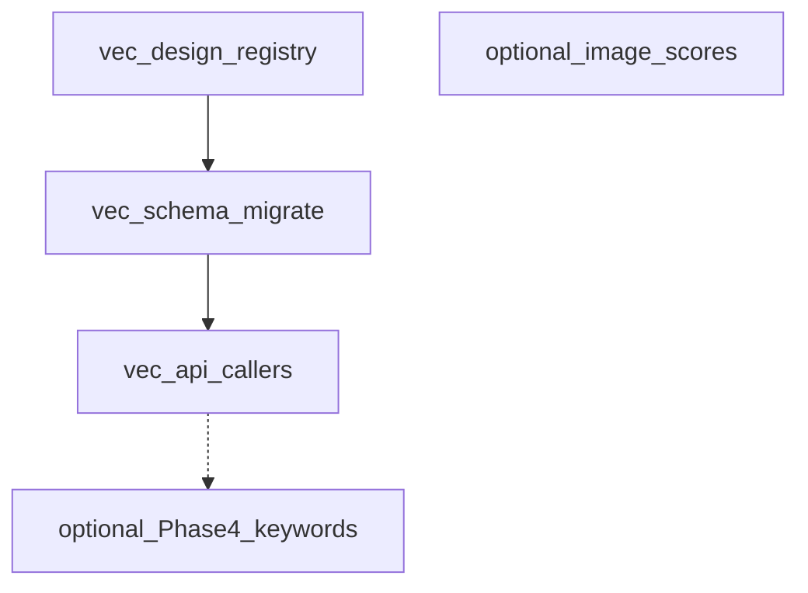

# DB refactor plan — multi-type vectors (primary) + optional normalization (secondary)

## Primary goal — different types of vectors

Today the system assumes **one** visual embedding per image: `images.image_embedding` as `vector(1280)` (MobileNetV2 GAP) in Postgres and a float32 BLOB in Firebird. See [EMBEDDINGS.md](../../technical/EMBEDDINGS.md).

**Product goal:** Persist **several non-interchangeable** vector spaces (e.g. current CNN visual features, future CLIP image tower, optional text embeddings keyed by image+caption version) with:

- Stable **model identity** (`model_key` / `embedding_kind`) and **dimension** `N`
- **Version** or weights identity for invalidation/recompute
- **Separate ANN indexes** per space (pgvector HNSW is per column; spaces with different `N` cannot share one `vector` column)

### pgvector constraint (drives schema shape)

A single column is typed `vector(N)` with **fixed N**. You cannot store 1280-d and 512-d vectors in the same column. Practical patterns:

| Pattern                                                  | When to use                                                                                                                                                                                                       |
| -------------------------------------------------------- | ----------------------------------------------------------------------------------------------------------------------------------------------------------------------------------------------------------------- |
| **A. Few known kinds**                                   | Add nullable columns on `images`, e.g. `embedding_visual vector(1280)`, `embedding_clip_image vector(512)` — each with its own HNSW index. Simple queries, no join.                                               |
| **B. Catalog + one physical table per dimension family** | e.g. `image_embeddings_1280(image_id, kind, vector(1280), model_version, updated_at)` with `UNIQUE(image_id, kind)` — multiple models sharing dim (rare) or one row per kind with CHECK on allowed `kind` values. |
| **C. One table per kind**                                | `image_emb_mobilenet_v2(...)`, `image_emb_clip_vit_b32(...)` — clearest indexes and migrations; more DDL when adding kinds.                                                                                       |

Recommended starting point: **(A) or (C)** — avoid a generic "EAV with one bytea vector" that loses pgvector indexing.

Add a small **registry table** (e.g. `embedding_spaces`: `code`, `dim`, `description`, `active`) so the app and migrations agree on valid kinds and dimensions.

### Migration / expand-contract

1. Introduce new storage (chosen pattern) and registry row for existing MobileNet space (e.g. `mobilenet_v2_imagenet_gap`, dim 1280).
2. **Backfill** from `images.image_embedding` into the new structure.
3. **Dual-read window:** similarity search and clustering read from new storage with fallback to legacy column.
4. **Dual-write:** all writers update new storage + legacy column until callers are switched.
5. **Drop or null legacy column** after one release cycle and update [EMBEDDINGS.md](../../technical/EMBEDDINGS.md).

### Code touchpoints (non-exhaustive)

- [modules/db_postgres.py](../../../modules/db_postgres.py) — DDL, `POSTGRES_APP_TABLES`, HNSW indexes
- [migrations/versions/](../../../migrations/versions/) — new revision(s)
- [modules/db.py](../../../modules/db.py) — `update_image_embedding(s)`, `get_embeddings_for_search`, `get_images_missing_embeddings`, Postgres embedding write paths (see CHANGELOG notes)
- [modules/clustering.py](../../../modules/clustering.py) — `CLUSTER_VERSION` / model identity when persisting
- [modules/similar_search.py](../../../modules/similar_search.py) — `EMBEDDING_DIM`, query space selection
- [scripts/maintenance/populate_missing_embeddings.py](../../../scripts/maintenance/populate_missing_embeddings.py) — `--kind` or default kind
- API / MCP — any tool that assumes a single embedding column must take or default `embedding_kind`

### Firebird / Electron

Multi-vector may be **Postgres-first**: Firebird can keep a single BLOB for the legacy gallery path until Phase 4 Postgres migration, or gain a parallel `IMAGE_EMBEDDINGS` table with `(image_id, kind, blob)` without pgvector. Document the chosen parity rule in the implementation ticket.

### Success criteria (vectors)

- Adding a second kind (e.g. 512-d) does not require altering the 1280-d column's type.
- Similarity and clustering APIs explicitly select **which space**; no cosine search across mismatched dimensions.
- P95 similarity queries remain acceptable with **one HNSW index per queried column/table**.
- [EMBEDDINGS.md](../../technical/EMBEDDINGS.md) checklist (model identity, dim, semantics, version, indexes, callers) is filled for each stored space.

### Gallery (Electron) Compatibility

The `image-scoring-gallery` (Electron) application is a major consumer of the `images` table.

- **Vector Refactor**: No immediate impact, as Electron does not query embeddings directly.
- **Normalization (A0, A1)**: **High Risk.** Electron relies on denormalized `keywords` and `score_*` columns in `images` (see [DATABASE_REFACTOR_ANALYSIS.md](https://github.com/synthet/image-scoring-gallery/blob/main/docs/technical/DATABASE_REFACTOR_ANALYSIS.md) in **image-scoring-gallery**.)
- **Mitigation**: Any removal of legacy columns in `images` must be preceded by a **VIEW** that maintains the legacy schema interface for the gallery.

---

## As implemented (PostgreSQL) — registry + per-dimension fact tables

Physical storage is a **hybrid of plan Pattern B (per dim family)** plus a Pattern A-style legacy column. One central registry governs valid space codes; each dimension family lives in its own fact table so `vector(N)` can stay fixed per-table:

| Object | Role |
|--------|------|
| `embedding_spaces` | Registry: `code`, `dim`, `description`, `active`. Seeded with `mobilenet_v2_imagenet_gap` (1280), `clip_vit_b32_image` (512), `bioclip_2_image` (512), `blip_vit_b16_image` (768). |
| `image_embeddings` | 1280-d fact table (legacy name kept for the original family). `(image_id, embedding_space_id)` unique; `embedding vector(1280)`; HNSW cosine. |
| `image_embeddings_512` | 512-d fact table for CLIP / BioCLIP. Same shape; `embedding vector(512)`; HNSW cosine; `UNIQUE(image_id, embedding_space_id)`. |
| `image_embeddings_768` | 768-d fact table for BLIP. Same shape; `embedding vector(768)`; HNSW cosine. |
| `images.image_embedding` | **Legacy / dual-write** column for the 1280-d space; readers use `COALESCE(ie.embedding, i.image_embedding)` where applicable. |

- **DDL / greenfield:** [`modules/db_postgres.py`](../../../modules/db_postgres.py) `_init_db_transaction()` — creates all four embedding tables, HNSW indexes, and seeds the four registry rows; mirrored in `POSTGRES_APP_TABLES` for truncate order.
- **Upgrade path:** Alembic [`0004_embedding_spaces_image_embeddings.py`](../../../migrations/versions/0004_embedding_spaces_image_embeddings.py) created the 1280-d table + backfill from `images.image_embedding`. [`0012_multi_dim_image_embeddings.py`](../../../migrations/versions/0012_multi_dim_image_embeddings.py) added the 512-d and 768-d fact tables and seeded the three new registry rows.
- **Constants / space id cache:** [`modules/embedding_spaces.py`](../../../modules/embedding_spaces.py) — `SPACE_DIMS`, `get_embedding_space_id` (caches positive hits only; misses fall through to a fresh DB lookup, so a process started before its registry row was seeded recovers automatically).
- **Dim → table routing:** [`modules/db_legacy.py`](../../../modules/db_legacy.py) `_pg_embedding_table_for_dim(dim)` — `1280 → image_embeddings`, `512 → image_embeddings_512`, `768 → image_embeddings_768`.

**Adding a fourth dimension family (e.g. 1024-d)** requires touching four places — see *Adding a new dim family* in the operational notes below.

---

## Worklog

| Date | Area | Notes |
|------|------|--------|
| 2026-04-01 | Schema | `embedding_spaces` + `image_embeddings` added in `db_postgres.py`; `POSTGRES_APP_TABLES` extended for truncate order. |
| 2026-04-01 | Migration | Revision `0004` — create registry + junction table, HNSW on `image_embeddings.embedding`, seed row, backfill from `images.image_embedding`, `SET NOT NULL` on `embedding`. |
| 2026-04-01 | `db.py` | `_pg_default_embedding_space_subquery_sql`, `_postgres_has_default_embedding_sql`; dual-write in `update_image_embedding` / `update_image_embeddings_batch` (optional `model_version`); dual-read via `LEFT JOIN` + `COALESCE` for getters, `get_embeddings_for_search`, `get_embeddings_with_metadata`, tag-propagation queries; Postgres-specific `_get_images_missing_embeddings_pg`; `list_folder_paths_with_missing_keywords` embed clause on Postgres. |
| 2026-04-01 | `similar_search.py` | Postgres path uses `COALESCE(ie.embedding, i.image_embedding)` with join to `image_embeddings` for search / counts / near-duplicate SQL. |
| 2026-04-03 | Docs | Worklog + EMBEDDINGS.md update; reconciled plan text with implemented Pattern B–style layout (removed obsolete Pattern C table-per-kind spec). |
| 2026-04-23 | Schema | Alembic revision `0012` — new per-dimension fact tables `image_embeddings_512` and `image_embeddings_768` (same shape as `image_embeddings`), HNSW cosine indexes, and seeded `embedding_spaces` rows for `clip_vit_b32_image` (512), `bioclip_2_image` (512), and `blip_vit_b16_image` (768). Mirrored DDL + seed in `modules/db_postgres._init_db_transaction()`; extended `POSTGRES_APP_TABLES` for truncate order and post-truncate re-seed. |
| 2026-04-23 | `db.py` | Added `_pg_embedding_table_for_dim(dim)` (1280/512/768 → table), `update_image_embeddings_batch_for_space(space_code, rows)` with dim-vs-registry validation and `ON CONFLICT (image_id, embedding_space_id) DO UPDATE`, and `get_images_missing_embedding_for_space(space_code, folder_path, limit)`. Existing 1280-d writers unchanged. `modules/embedding_spaces.py` gained `SPACE_DIMS` and a cached `get_embedding_space_id(code)` helper. |
| 2026-04-23 | Piggyback | New `modules/embeddings_extract.py` with pure L2-normalizing helpers for CLIP (`image_embeds`), BLIP (`vision_model.pooler_output`), and BioCLIP (`encode_image`). `KeywordScorer.predict`, `CaptionGenerator.generate(extract_embedding=...)`, and `BioCLIPClassifier.classify` now capture `last_image_embedding`; `TaggingRunner` and `BirdSpeciesRunner` flush via `update_image_embeddings_batch_for_space` in best-effort try/except gated by the new `embeddings.persist_*` config flags. `model_version` is read from `embeddings.model_versions.*`. |
| 2026-04-23 | Consumers | `modules/similar_search.search_similar_images(..., embedding_space=None)` dispatches to a Postgres-only helper that reads from the per-dim table. MCP `search_similar_images` forwards the new param; MCP `get_embedding_stats` accepts `embedding_space` and, when unset, also returns a `per_space` coverage breakdown. |
| 2026-04-23 | Tests | `tests/test_postgres_integration.py` asserts the two new tables, seeded registry rows, HNSW indexes, unique constraints, and upsert + dim-validation semantics. New `tests/test_embeddings_multi_space.py` covers the pure extractors, `_pg_embedding_table_for_dim` routing, registry-mismatch `ValueError`, non-Postgres no-op, and the `TaggingRunner._persist_tagging_embeddings` flag gating with mocks. |
| 2026-04-24 | Diagnostics | Investigated empty `image_embeddings_512` / `_768` tables on a live DB after v7.4.8: registry has all four spaces (migration `0012` ran), keywords jobs ran post-release (last on 2026-04-24, 53,728 `image_phase_status` rows `done`), but `webui.log` showed zero embedding-persist lines. Root cause: silent failure path — webui process started before migration `0012` seeded the new spaces, `get_embedding_space_id` cached `None` for the three codes, and every persist call no-oped at the registry-miss guard in `update_image_embeddings_batch_for_space`. |
| 2026-05-24 | Schema | Alembic `0024_drop_images_image_embedding` — backfill column-only rows, drop `idx_images_embedding_hnsw` and `images.image_embedding`. Config `database.write_legacy_image_embedding_column` gates dual-write until column removed; see [IMAGE_EMBEDDING_COLUMN_DEPRECATION.md](IMAGE_EMBEDDING_COLUMN_DEPRECATION.md). Issue [#225](https://github.com/synthet/image-scoring-backend/issues/225). |
| 2026-04-24 | `embedding_spaces.py` | `get_default_embedding_space_id` and `get_embedding_space_id` now cache *positive* hits only — misses fall through to a fresh DB lookup on the next call. A long-running process started before its registry rows were seeded recovers automatically once the migration completes; no restart required. The unused `invalidate_default_embedding_space_cache()` helper was retained but is no longer load-bearing. |
| 2026-04-24 | `tagging.py` | `_persist_tagging_embeddings` and the outer best-effort wrapper in `_run_batch_internal` now log persist failures at `WARNING` instead of `DEBUG`, so real upsert errors (dim mismatch, connection, schema drift) appear in `webui.log` at default log levels. Added a one-time `WARNING` per `TaggingRunner` instance when the shared-engine path is taken with `embeddings.persist_clip_image` / `persist_blip_image` enabled — production paths use `TaggingRunner()` with no engine arg and are unaffected; tests / agent integrations now discover the gap visibly. |

### Follow-ups (completed)

✓ **`modules/mcp_server.py` `get_embedding_stats`** — Uses `_postgres_has_default_embedding_sql()` + join to `image_embeddings` on Postgres for accurate stats (lines ~1005–1029).

✓ **`modules/clustering.py`** — Passes `model_version=CLUSTER_VERSION` to `update_image_embeddings_batch()` (line ~707).

✓ **`repair_culling_ips_failed_has_data`** / **`get_image_tag_propagation_focus`** — Both use `COALESCE` + join to `image_embeddings` on Postgres paths (db.py ~7186–7215, ~8007–8018).

### Remaining optional work

- **Scripts:** `populate_missing_embeddings.py` — optional CLI `--embedding-space` for backfilling the 512-d / 768-d spaces. Today only piggyback writes populate them; new spaces have no offline backfill helper.
- **Cleanup:** Remove any leftover one-off patch scripts under `tools/` used during bring-up (e.g. `run_vec.py`, `vec_apply.py`) if still present.

---

## Operational notes (gotchas for the next implementer)

**Cache staleness on long-running processes.** `get_embedding_space_id(code)` only caches *positive* hits. A miss (engine wasn't Postgres at first call, registry row not yet seeded, transient DB error) falls through to a real DB lookup next time, so a webui / runner started before an Alembic migration adds new spaces will recover automatically once the migration completes — no restart strictly required. If you ever change this to negative-cache, also wire `invalidate_default_embedding_space_cache()` (currently unreferenced) into a post-migration hook.

**Shared-engine code path doesn't persist embeddings yet.** `TaggingRunner` only calls `_persist_tagging_embeddings` on the non-`tagging_engine` branch (separate `KeywordScorer` + `CaptionGenerator`). The shared-engine path (`engines/base.py`) currently doesn't expose `last_image_embedding`, so CLIP/BLIP rows never get written through it. Production call sites (`cli.py`, `modules/ui/app.py`, `scripts/python/heal_folders.py`) all use the non-engine path and persist correctly. A WARNING is emitted once per runner instance if the engine path is taken with persist flags enabled, so the gap is discoverable.

**BLIP-768 only fills when captions are generated.** `CaptionGenerator.generate(extract_embedding=True)` is what populates `last_image_embedding`. If a tagging job runs with `generate_captions=False` (the default in some flows), `image_embeddings_768` will not grow even when CLIP embeddings are landing in `image_embeddings_512`. This is by design — BLIP's vision tower is only worth running when we already need a caption.

**BioCLIP-512 only fills during bird-species jobs.** `BirdSpeciesRunner` is the only writer. Empty `image_embeddings_512` rows for `bioclip_2_image` are usually "no bird-species job has run", not a defect.

**Firebird parity stance.** Multi-vector storage is **Postgres-only**. Firebird retains the single-BLOB `IMAGES.IMAGE_EMBEDDING` column (1280-d MobileNet only) until the gallery (`image-scoring-gallery`) migrates to Postgres. New per-model embeddings will not be visible to Electron until that cutover.

### Adding a new dim family (e.g. 1024-d)

Five touch-points must agree — `_pg_embedding_table_for_dim` raises `ValueError` and registers a no-op upsert if any one is missed:

1. `modules/embedding_spaces.py` — add the `*_SPACE_CODE` / `*_DIM` constants and an entry in `SPACE_DIMS`.
2. New Alembic revision under `migrations/versions/` — `CREATE TABLE image_embeddings_1024 (…)`, HNSW cosine index, `UNIQUE(image_id, embedding_space_id)`, seed an `embedding_spaces` row.
3. `modules/db_postgres.py` — mirror the new DDL + seed in `_init_db_transaction()`; add `image_embeddings_1024` to `POSTGRES_APP_TABLES` (truncate order).
4. `modules/db_legacy.py` `_pg_embedding_table_for_dim(dim)` — extend the dim → table map.
5. Tests — extend `tests/test_postgres_integration.py` to assert the new table + registry row.

---

## Appendix — broader schema normalization (deferred / optional)

The following was the **previous** aggressive normalization scope; it remains valid as a **separate track** after or in parallel with vector work where team capacity allows.

### A0 — Baseline (Phase 4 keywords/metadata)

- [NEXT_STEPS.md](NEXT_STEPS.md): validation, perf gates, deprecate redundant `images.keywords` / related writable dupes
- `electron/db.ts` (image-scoring-gallery repo): keyword `LIKE` → normalized `EXISTS` / `keywords_dim`

### A1 — `image_scores` fact table

- Decompose `images.score_*` + `scores_json` into `(image_id, metric_code, value, …)` with expand-contract and view compatibility (high query churn on [modules/db.py](../../../modules/db.py))

### A2 — `job_scopes` etc.

- Normalize `jobs.scope_paths` / structured `queue_payload`

### A3 — Integrity

- CHECK constraints; `image_xmp.stack_id` vs `stacks.id` strategy per [DB_SCHEMA_REFACTOR_PLAN.md](DB_SCHEMA_REFACTOR_PLAN.md)

### Explicit non-goals (unchanged)

- `folders.phase_agg_*`, `stack_cache`, `file_name` / `file_type` — keep as caches or convenience denormalization unless there is a separate product reason to change them.

