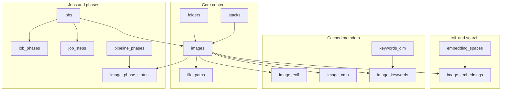

# PostgreSQL schema analysis, structure, and optimization roadmap

This document provides a detailed analysis of the PostgreSQL database structure for the Vexlum Scoring project, its data characteristics, and a roadmap for optimizations. It supersedes parts of the Firebird-centric [DB_SCHEMA.md](../../technical/DB_SCHEMA.md).

## Schema Organization

The canonical PostgreSQL DDL is managed via Alembic migrations. The core structure revolves around an **images** fact table surrounded by pipeline telemetry, metadata caches, and normalized keywords.

## Nature of Stored Data

### 1. `images` — Primary Asset Row
- **Identity:** `file_path`, `file_name`, `folder_id`, `image_uuid`, `image_hash`.
- **ML Scores:** Nullable floats for multiple dimensions (general, technical, aesthetic, etc.); `scores_json` (TEXT) for full model output.
- **Embeddings:** `image_embedding vector(1280)` with HNSW index; transition plan involves moving this to the dedicated `image_embeddings` junction table.
- **Metadata:** `metadata` (TEXT), `rating`, `label`, and legacy `keywords` (TEXT).

### 2. `embedding_spaces` + `image_embeddings`
- Supports multiple non-interchangeable vector spaces (e.g., MobileNetV2, CLIP).
- `image_embeddings` holds `(image_id, embedding_space_id)` pairs with `vector(1280)` and HNSW indexing.

### 3. `image_exif` / `image_xmp`
- Denormalized caches of EXIF (camera, ISO, date) and XMP (rating, label) for fast gallery filtering without parsing files or JSON blobs.

### 4. `image_phase_status`
- Sparse matrix tracking each image's progress through pipeline phases (indexing, scoring, tagging, etc.).

### 5. `deleted_images`
- Tombstone table populated by `BEFORE DELETE` triggers on `images` to prevent re-importing assets and to sync deletions to backup drives.

---

## Optimization Roadmap (Task Backlog)

### A — Embeddings and Vector Indexes
- **[A1] ADR — single source of truth for embeddings.** Consolidate `images.image_embedding` column into the `image_embeddings` table. **In progress (2026-05-24):** migration `0024`, `verify_embedding_column_parity.py`, config gate — [IMAGE_EMBEDDING_COLUMN_DEPRECATION.md](IMAGE_EMBEDDING_COLUMN_DEPRECATION.md).
- **[A2] Migration — dedupe vectors and indexes.** Drop redundant HNSW indexes; update `db.py` batch writers.
- **[A3] Tune vector indexes for scale.** Benchmark HNSW (`m`, `ef_construction`) vs IVFFlat.

### B — JSON / TEXT Columns
- **[B1] Audit JSON access patterns.** Identify hot fields in `metadata` and `scores_json`.
- **[B2] Migrate to `jsonb`.** Convert `TEXT` to `jsonb` for efficient query predicates; add GIN indexes where needed.

### C — Gallery / Listing Indexes
- **[C1] Baseline slow queries.** Baseline folder-scoped listings and sort orders using `EXPLAIN ANALYZE`.
- **[C2] Targeted indexes.** Add composite indexes for common filter+sort combinations (e.g., `folder_id` + `score_general`).

### D — Integrity (Statuses / Labels)
- **[D1] Status vocabulary inventory.** ✅ Done — see [STATUS_VOCABULARY.md](STATUS_VOCABULARY.md).
- **[D2] Enforce constraints.** Partially done: Alembic rev. `0014_status_check_constraints.py` adds `CHECK ck_image_phase_status_status` (9 `PhaseStatus` values). `jobs.status` and `job_phases.state` deferred — empirical inventory found `canceled`/`cancelled` co-existence and additional values not in the original D1 list; normalization required first. See the **Summary table for D2 planning** in [STATUS_VOCABULARY.md](STATUS_VOCABULARY.md).

### E — Timestamps
- **[E1] ADR — `timestamptz` scope.** Decide on global transition to `TIMESTAMP WITH TIME ZONE`.
- **[E2] Migrate columns.** Backfill existing timestamps with `AT TIME ZONE`.

### F — Keyword Search
- **[F1] Product — search UX.** Choose between FTS (`tsvector`), trigram (`pg_trgm`), or hybrid for keywords.
- **[F2] Implement + index.** maintain search vectors via trigger or generated column.

### G — Jobs Growth and Archival
- **[G1] Ops — retention policy.** Define age/count limits for historical job telemetry.
- **[G2] Partitioning.** Partition `jobs` and `job_steps` by `created_at` or move to archive tables.

### H — `image_phase_status` Primary Key
- **[H1] Composite PK.** Drop surrogate `id` column; use `(image_id, phase_id)` as Primary Key.

### I — Documentation & Validation
- **[I1] Postgres schema doc.** (This document).
- **[VAL] Validation playbook.** Create a checklist for `pg_stat_*` monitoring and index health.
