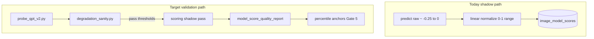

# QPT V2 validation gates

**Status:** Planned (implementation not started)  
**Issue:** [#185](https://github.com/synthet/image-scoring-backend/issues/185) — calibration layer + percentile anchors  
**Related:** [CALIBRATION_LAYER_185_STATUS.md](CALIBRATION_LAYER_185_STATUS.md), [IQA_MODEL_STACK_UPDATE_PROPOSAL.md](IQA_MODEL_STACK_UPDATE_PROPOSAL.md), [MODEL_RECOMMENDATIONS_PIPELINES.md](../../MODEL_RECOMMENDATIONS_PIPELINES.md)

---

## Executive summary

**QPT V2** (Quality & Aesthetics Pre-training v2, ACM MM 2024) is a **runnable research checkpoint**, not a **production-ready scoring component** in Vexlum today.

| Dimension | Assessment |
|-----------|------------|
| **Feasible to run** | Yes — local HiViT-T re-implementation loads `iqa.pth` (172/172 tensors) |
| **Production trustworthy** | No — upstream inference recipe incomplete; raw scores unvalidated |
| **Correct config posture** | `scoring.models.qpt_v2: { enabled: false, shadow: true }` |
| **Fusion** | Do **not** fuse into `score_general`, `score_technical`, or `score_aesthetic` until gates pass |

**Bottom line:** Worth experimenting with in **shadow / diagnostics / research** mode. Do not promote to default fusion until validation improves real culling decisions, not just paper benchmark numbers.

---

## Upstream status (2026-05)

- Paper accepted at **ACM MM 2024** — unified masked-image-modeling pretraining for image quality, video quality, and image aesthetics.
- GitHub: [KeiChiTse/QPT-V2](https://github.com/KeiChiTse/QPT-V2)
- **Checkpoints released** (`checkpoints/iqa.pth`, `iaa.pth`, `vqa_*.pth`).
- **Inference and training code** remain open TODOs in the upstream README; no formal GitHub releases.
- Community reports ([QPT-V2 issue #2](https://github.com/KeiChiTse/QPT-V2/issues/2)) of unsatisfactory scores when the full recipe is unknown.

### Research benchmarks (AVA, from project reports)

| Model | AVA SRCC (approx.) | Notes |
|-------|-------------------|--------|
| **QPT V2** | ~0.865 | SOTA in surveys; HiViT-T ~19M params |
| Q-Align | ~0.822 | Large LMM; heavy for 8 GB VRAM |
| LIQE | ~0.776 | CLIP-based; live in production fusion |
| MUSIQ | ~0.726 | Legacy backbone (SPAQ/AVA variants) |

Paper SRCC does **not** substitute for validation on your corpus and preprocessing path.

---

## Current repo integration

| Piece | Location | Notes |
|-------|----------|--------|
| Architecture | `modules/qpt_v2_arch.py` | Rebuilt from `iqa.pth` state dict |
| Scorer | `modules/qpt_v2.py` | Preprocess: resize-short-256 + center-crop 224 |
| Registry wrapper | `modules/engines/qpt_v2_model.py` | Registered at import in `modules/engines/__init__.py` |
| Config | `config.example.json` | `shadow: true`, checkpoint `models/qpt_v2.pth` |
| Shadow storage | `image_model_scores` via `MultiModelHost` | `is_shadow=true`; not fused |
| Calibration | `modules/score_normalization.py` | No `qpt_v2` anchors yet |

### Observed behavior (local, provisional)

- Raw score range approximately **`[-0.25, 0]`** — not 0–1 MOS.
- Blur tends to **lower** scores (directionally sensible).
- Offline blur monotonicity (May 2026): Spearman **−0.81** with center-crop preprocess (vs **−0.66** squash-resize).
- Thumbnail substrate weakens signal; prefer **full-resolution** exports for Gate 2.

### Critical bug (fix in Phase 0)

`QptV2ModelWrapper.score_range = (0.0, 1.0)` disagrees with observed raw outputs. `MultiModelHost` linear-normalizes before DB write, so shadow `normalized` values are mostly clamped to **0** — unusable for correlation and anchor computation until fixed.

---

## Validation strategy

Separate two questions:

1. **Can we run a checkpoint at all?** → Gate 1 (probe).
2. **Can we trust it as a calibrated scorer?** → Gates 2, 3, 5 (and deferred Gate 4).



### Non-goals

- Do **not** enable `qpt_v2` for production fusion until gates pass.
- Do **not** promote in [MODEL_RECOMMENDATIONS_PIPELINES.md](../../MODEL_RECOMMENDATIONS_PIPELINES.md) until Gates 2–3 pass on full-res corpus.
- **Gate 4 (human labels)** deferred — no labelled-set tooling in the first implementation pass.

---

## Gate 0 — Fix raw vs normalized semantics (prerequisite)

**Files:** `modules/qpt_v2.py`, `modules/engines/qpt_v2_model.py`, `modules/engines/host.py`, `tests/test_engines_wrappers.py`

1. Document provisional native range on the scorer (e.g. `NATIVE_SCORE_RANGE = (-0.30, 0.05)` — refine after Gate 2).
2. Set `QptV2ModelWrapper.score_range` to match; update `SCORE_RANGE` string for API/logs.
3. Override `normalize()` on the wrapper:
   - If `percentile_anchors` / `DEFAULT_PERCENTILE_ANCHORS` contains `qpt_v2` → use `rescale_percentile()` in `modules/score_normalization.py`.
   - Else → return `None`.
4. In `MultiModelHost._run_one`: when `normalize()` returns `None`, store `raw_score` only; leave `normalized` null in DB.

Keeps shadow storage honest until Gate 5 anchors exist.

---

## Gate 1 — Reproducible single-image probe

**Planned script:** `scripts/debug/probe_qpt_v2.py`

Run in WSL with `~/.venvs/tf` (same as other module scripts):

```bash
python scripts/debug/probe_qpt_v2.py path/to/image.jpg
python scripts/debug/probe_qpt_v2.py path/to/image.jpg --json
python scripts/debug/probe_qpt_v2.py path/to/image.jpg --device cpu
```

**Expected JSON output:**

```json
{
  "model": "qpt_v2_iqa",
  "checkpoint": "<resolved path>",
  "raw_score": -0.123,
  "normalized_score": null,
  "preprocess": "resize_short_256_center_crop_224",
  "device": "cuda",
  "available": true,
  "score_range_native": [-0.30, 0.05]
}
```

Construct `QptV2Scorer` directly (no full scoring host). Exit non-zero if checkpoint missing or `available=false`.

**Checkpoint setup:** Download `iqa.pth` from [KeiChiTse/QPT-V2](https://github.com/KeiChiTse/QPT-V2) `checkpoints/` and place at `scoring.qpt_v2.checkpoint_path` (default `models/qpt_v2.pth`, git-ignored).

---

## Gate 2 — Monotonic degradation sanity

**Planned script:** `scripts/analysis/qpt_v2_degradation_sanity.py`

In-memory PIL variants (no temp files required):

| Variant | Transform |
|---------|-----------|
| `original` | none |
| `jpeg_90` / `jpeg_60` / `jpeg_30` | re-encode via BytesIO |
| `gaussian_blur_1` / `gaussian_blur_3` | `ImageFilter.GaussianBlur` |
| `underexposed` / `overexposed` | brightness scale |
| `noise` | Gaussian noise overlay |

For each input (single file or `--folder` with `--limit`):

1. Score all variants.
2. Compute **Spearman** between severity index and raw score (expect **negative** — more degradation → lower score).
3. Emit JSON + summary with thresholds:

| Result | Mean Spearman (per image) |
|--------|---------------------------|
| **Pass** | ≤ **−0.80** |
| **Warn** | −0.80 to −0.60 |
| **Fail** | > −0.60 or wrong sign |

**Important:** Run on **full-res exports**, not pipeline thumbnails.

**Planned tests:** `tests/test_qpt_v2_degradation.py` — math on synthetic series; `@pytest.mark.gpu` integration skips without checkpoint.

---

## Gate 3 — Shadow corpus + model correlation

### 3a — Shadow scoring pass (operational)

With checkpoint in place and config unchanged (`shadow: true`, `enabled: false`):

1. Run a **scoring** job on a representative folder (wildlife bursts, landscapes, portraits) via UI/API.
2. Verify rows:

```sql
SELECT model_name, COUNT(*)
FROM image_model_scores
WHERE model_name = 'qpt_v2'
GROUP BY 1;
```

If shadow fails to load, use Gate 1 probe to diagnose checkpoint path.

### 3b — Extend corpus report

**File:** `scripts/analysis/model_score_quality_report.py`

Planned changes:

- Prefer **`raw_score`** for models without percentile anchors (specifically `qpt_v2`).
- `--include-shadow` default true for QPT analysis; `--production-only` to exclude shadow rows.
- Pairwise Spearman/Pearson vs production models: `topiq`, `liqe`, `ava`, `spaq`.
- Rank agreement: top 10% / bottom 20% vs `score_general`; per-folder breakdown with `--folder-path`.

Compare against:

- TOPIQ-NR, MUSIQ/SPAQ, MUSIQ/AVA, LIQE
- PaQ-2-PiQ if legacy columns still populated

---

## Gate 4 — Human-labelled validation (deferred)

Not in scope for the first implementation pass.

When resumed, target:

- 300–1000 images with human pick / reject / maybe, technical failure tags, aesthetic preference tags.
- Evaluate usefulness for technical reject detection, aesthetic top-pick ordering, stack tie-breaking, false rejects on rare wildlife behavior.

---

## Gate 5 — Percentile anchors (after Gates 2–3 pass)

**Planned script:** `scripts/analysis/compute_qpt_v2_anchors.py`

1. Query `raw_score` for `model_name='qpt_v2'` (minimum ~500 images).
2. Compute `p02`, `p05`, `p50`, `p95`, `p98` (optionally `p01`/`p99` for diagnostics).
3. Print suggested JSON for `config.json` → `percentile_anchors.qpt_v2` and candidate patch for `DEFAULT_PERCENTILE_ANCHORS` in `modules/score_normalization.py` — **manual review before merge**.
4. Re-run `model_score_quality_report.py` to verify normalized distribution spans ~[0, 1].

**Promotion criteria (documentation only — not auto-enable):**

- Gate 2 pass on full-res sample set.
- Gate 3: Spearman vs TOPIQ/LIQE not inverted noise.
- Anchors stable across two folder samples.

Only then consider a follow-up issue for **shadow fusion experiment** — still not default production.

---

## What would make QPT V2 “real enough” for production?

| Gate | Requirement |
|------|-------------|
| 1 | Documented probe script with reproducible JSON |
| 2 | Degradation monotonicity passes on full-res samples |
| 3 | Shadow corpus correlates sensibly with live models |
| 4 | Human pick/reject validation (deferred) |
| 5 | Empirical percentile anchors from shadow corpus |

Production fusion requires **all of the above** (including Gate 4 when labelling exists) plus evidence that QPT V2 improves culling decisions, not only benchmark SRCC.

---

## Implementation todos

| ID | Task | Status |
|----|------|--------|
| `fix-normalize` | Phase 0: native score_range, normalize(), null normalized in host | Pending |
| `gate1-probe` | `scripts/debug/probe_qpt_v2.py` + unit test | Pending |
| `gate2-degrade` | `qpt_v2_degradation_sanity.py` + pytest | Pending |
| `gate3-report` | Extend `model_score_quality_report` for QPT raw scores | Pending |
| `gate5-anchors` | `compute_qpt_v2_anchors.py` (after Gates 2–3) | Pending |
| `docs-185` | Cross-link from CALIBRATION_LAYER_185_STATUS | Pending |

---

## Execution order


1. Phase 0 — code fix + tests  
2. Gate 1 — probe one image  
3. Gate 2 — degradation on full-res samples  
4. Gate 3 — shadow pass + correlation report  
5. Gate 5 — anchors PR (data-dependent)

---

## Test plan

| Check | Command |
|-------|---------|
| Fast unit | `pytest tests/test_engines_wrappers.py tests/test_qpt_v2_arch.py tests/test_qpt_v2_degradation.py tests/test_model_score_quality_report.py -m "not gpu"` |
| GPU probe | `python scripts/debug/probe_qpt_v2.py <image>` |
| GPU degradation | `python scripts/analysis/qpt_v2_degradation_sanity.py --folder <path> --limit 20` |
| Corpus report | `python scripts/analysis/model_score_quality_report.py --folder-path "<path>"` |

---

## Issue tracking

Work ties to **#185**. Keep Project card **Blocked** until Gate 2 passes on full-res; move to **In Progress** on first implementation commit.

See [00-backlog-workflow.md](../../project/00-backlog-workflow.md) for Stage transitions.
