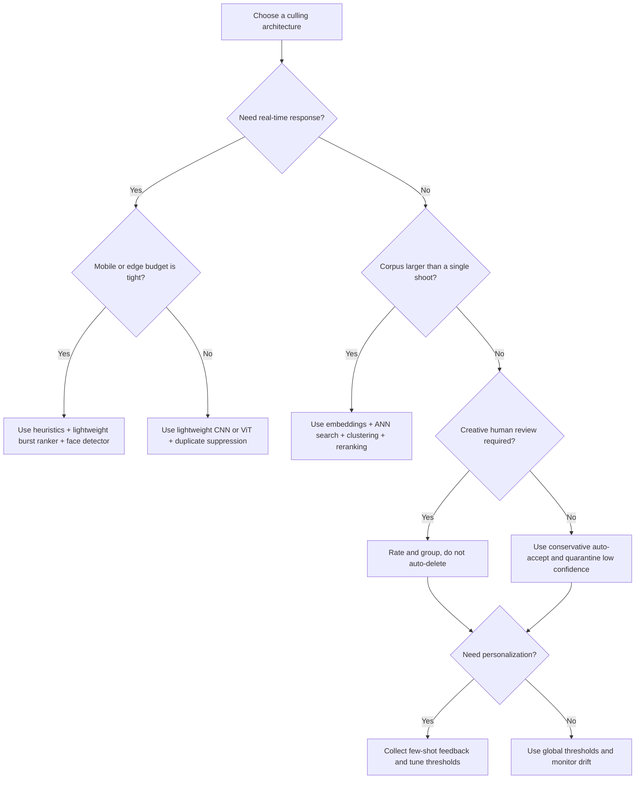

> **Status:** External research snapshot (not a product spec).
> **Source:** Ingested from `deep-research-report (9).md`, 2026-05-23.
> **Note:** Inline Deep Research citation markers were removed. Verify metrics against primary papers before external citation.

## Relation to Vexlum Scoring

- **Similarity clustering / stacks:** [04-clustering-culling-stacks.md](../features/implemented/04-clustering-culling-stacks.md), [CULLING_FEATURE.md](../technical/CULLING_FEATURE.md)
- **Quality scoring (MUSIQ, TOPIQ, etc.):** [02-scoring-and-models.md](../features/implemented/02-scoring-and-models.md), [DEEP_RESEARCH_REPORT.md](DEEP_RESEARCH_REPORT.md)
- **Culling analytics:** [CULLING_ANALYTICS.md](../technical/CULLING_ANALYTICS.md)
- **Proposed adaptive hierarchical design:** [SMART_CULLING_ADAPTIVE_HIERARCHICAL_DESIGN.md](../planning/refactoring/SMART_CULLING_ADAPTIVE_HIERARCHICAL_DESIGN.md)

| Related report | Topic |
|----------------|-------|
| [DEEP_RESEARCH_REPORT.md](DEEP_RESEARCH_REPORT.md) | IQA model selection (QualiCLIP, TOPIQ, ARNIQA) |
| [CLIP_MODELS_CULLING_SCORING_2026-05-23.md](CLIP_MODELS_CULLING_SCORING_2026-05-23.md) | CLIP-family models for culling and prompt scoring |
| [IAA_MODELS_SURVEY_2024_2025.md](IAA_MODELS_SURVEY_2024_2025.md) | Aesthetic assessment models survey |

---

# Image Auto-Culling Algorithms and Best Practices

## Executive summary

Image auto-culling is best understood as **automated ranking, grouping, and conservative rejection** inside a bounded photo set, rather than as a single monolithic algorithm. In practice, the strongest systems are hybrids: they use cheap heuristics to catch obvious technical failures, visual embeddings and clustering to group near-duplicates, learned quality or aesthetic models to score survivors, and face or subject-aware modules to keep semantically important frames. Both the research literature and current production tools converge on this pattern. End-user applications rarely hard-delete by default; instead, they write non-destructive ratings, labels, or XMP sidecars and expect a human review pass before final delivery.

There is also no single dominant public benchmark for “photo culling” as a whole. The field is fragmented into adjacent tasks: **blind image quality assessment**, **aesthetic assessment**, **burst ranking**, **near-duplicate or copy detection**, **face quality assessment**, and **personalized preference learning**. As a result, system design should be driven by the workflow: photographer culling favors duplicate grouping plus face/expression/focus signals; stock platforms need large-scale embedding retrieval plus multi-objective ranking; mobile apps need very small, low-latency models; surveillance is constrained as much by law and policy as by model accuracy.

The most robust engineering recommendation is therefore simple: **treat culling as a staged decision system, keep the first stage cheap, keep the final output non-destructive, expose confidence and reasons to users, and collect feedback for personalization or recalibration**. Research on few-shot personalized aesthetics now shows that small amounts of user input can materially improve ranking quality, while commercial tools already operationalize human review through scene grouping, close-ups, keeper/extras review, and XMP-based round-tripping into Lightroom, Capture One, or Adobe applications.

## Definitions and scope

For this report, **image auto-culling** includes any automated method that helps narrow a finite set of candidate images by assigning scores, ordering, grouping, or rejection labels. That includes: selecting the best frame in a burst; grouping near-duplicates and surfacing one representative; rejecting technically bad frames such as blurry or closed-eye shots; ranking images by perceived quality or aesthetics; selecting a target number of “keepers”; and task-specific filtering such as portrait utility or shareability ranking. Commercial tools explicitly expose these forms as “best of each group,” “exact number,” “duplicates,” “blurry,” “closed eyes,” “keepers,” “extras,” “scenes,” and similar constructs.

It **does not** primarily mean open-ended image search or generic content moderation across an unbounded corpus, although those technologies overlap. Near-duplicate or copy detection becomes part of culling when it is used to suppress redundant frames inside a shoot or to prevent multiple visually equivalent uploads. Likewise, face detection, saliency, or object detection are not culling by themselves, but they are core submodules when a system decides that a frame with an in-focus face or a more salient subject should outrank another.

A useful operational distinction is between **cull out** and **cull in**. “Cull out” removes or demotes bad images; “cull in” positively identifies keepers and lets the rest remain unrated or secondary. Imagen explicitly documents a cull-in workflow based on ratings for photos to keep, while Aftershoot, Narrative, and Imagen all support non-destructive metadata-based review rather than destructive file deletion as the primary handoff.

A second distinction is between **technical utility** and **aesthetic utility**. Technical utility focuses on blur, noise, exposure, duplication, eye closure, and biometric or subject visibility. Aesthetic utility tries to model human preference, composition, style, or shareability. Modern systems routinely combine both, because a technically perfect frame can still be a poor keeper, while a slightly imperfect frame may be the best storytelling image in a sequence.

## Algorithm taxonomy

In practice, auto-culling systems are rarely pure. They are usually **pipeline compositions** that mix hand-crafted rules with learned models and clustering. The table below summarizes the main families.

| Family | Core idea | Typical signals | Strengths | Main failure modes | Representative sources |
|---|---|---|---|---|---|
| Heuristic technical rules | Explicit thresholds or scores | Blur/sharpness, clipping, brightness, color cast, noise, EXIF metadata | Fast, interpretable, cheap on CPU; excellent first-pass filters | Brittle across genres, lighting, motion, and style; weak on semantic importance | BRISQUE and related no-reference IQA are efficient and pixel-only; SPAQ shows brightness, colorfulness, contrast, noisiness, and sharpness correlate with perceived quality.  |
| Perceptual hashing | Compare compact hashes | aHash, dHash, pHash, wHash, Hamming distance | Extremely fast for exact or lightly transformed duplicates | Breaks on stronger edits, crops, viewpoint changes, and semantic near-duplicates | ImageHash and pHash are standard open-source implementations.  |
| Embedding-based duplicate detection | Learn or extract visual descriptors, then retrieve nearest neighbors | CNN or ViT embeddings; ANN search | Stronger than hashes on transformed duplicates and web-scale corpora | Needs indexing, thresholds, and often a verification or reclustering stage | SSCD and fastdup are representative.  |
| Clustering for near-duplicates | Group similar frames before ranking within group | Embedding distance, time adjacency, connected components, k-means | Matches how photographers actually review bursts or scenes | Bad clustering hurts everything downstream; thresholds are task-specific | Care to Share uses explicit near-duplicate grouping; fastdup exposes connected components and k-means outputs.  |
| Learned quality or aesthetic scoring | Predict a continuous or ordinal utility score | MOS, rating distributions, pairwise preferences, multi-task attributes | Captures subtle quality and taste signals; works well for reranking | Needs labeled data; can inherit dataset bias; hard to personalize globally | NIMA, SPAQ models, MUSIQ, Charm, personalized task-vector methods.  |
| Burst or within-sequence ranking | Compare near-identical frames directly | Relative attributes, pairwise ranking within burst | Best for “pick one from many nearly identical frames” | Often sequence-specific; less transferable to broad album culling | Real-time burst selection on mobile is the canonical example.  |
| Face and subject-aware models | Promote frames with stronger subject utility | Face presence, landmarks, blink, focus on face, expression, object detection | Essential for portrait, wedding, event, and surveillance use cases | Privacy and bias risks; weak when faces are absent or intentionally obscured | CR-FIQA, MediaPipe Face Detector, Narrative close-ups and focus assessments.  |
| Saliency-aware selection | Weight subject-important regions more strongly | Saliency maps, segmentation masks, objectness, attention | Helps preserve composition and subject emphasis | Can over-favor obvious subjects and miss narrative context | U²-Net is a common saliency building block; Charm uses saliency maps for patch selection.  |
| Hybrid production pipelines | Fuse several of the above | Rule scores + embeddings + quality model + face signals | Best real-world accuracy/latency tradeoff | More moving parts and more calibration work | Commercial tools and most successful academic systems follow this pattern.  |

A practical takeaway is that **heuristics remain valuable**, but mostly as a **front-end filter**. They remove obviously bad frames cheaply, after which learned ranking models can spend compute on uncertain cases and duplicate groups. This staged architecture is also more explainable to users because the system can say “closed eyes,” “duplicate group,” “low sharpness,” or “lower aesthetic score” rather than returning a single opaque score.

## Representative papers

There is surprisingly little work on end-to-end generic culling as one benchmarked task. Instead, the strongest literature sits in neighboring problems that together define the modern culling stack.

| Paper | Year | Subtask | Key method | Main datasets | Headline result | Why it matters | Source |
|---|---:|---|---|---|---|---|---|
| **NIMA** | 2017 | Aesthetics and technical quality | CNN predicts full rating distributions using Earth Mover’s Distance rather than just mean score | AVA, TID2013, LIVE | On AVA, NIMA(Inception-v2) reached **81.51%** binary accuracy and **0.612 SRCC** on mean scores; on TID2013, NIMA(VGG16) reached **0.944 SRCC** on mean scores. | Established deep scoring of perceptual quality and aesthetics as a practical ranking primitive for culling. |  |
| **Real-time Burst Photo Selection Using a Light-Head Adversarial Network** | 2018 | Burst best-frame selection | Lightweight ranking model learns latent relative attributes for subtle intra-burst differences | Proprietary burst dataset from mobile capture | Best-frame prediction matched users’ **top-1 choice in 64.1%** of cases and **top-3 in 86.2%**; model size **0.47 MB** and **13 ms/frame** on iPhone 7. | Still one of the clearest demonstrations of real-time, on-device culling. |  |
| **Care to Share? Learning to Rank Personal Photos for Public Sharing** | 2018 | Album/shareability ranking | Three-step pipeline: near-duplicate grouping, ranking within groups, then group ranking | Large Flickr-based personal photo dataset | Group ranking with **L2RGroups** reached **P@1 0.310, MRR 0.470, MAP 0.427**; full **ThreeStepRanking** reached **MRR 0.380, P@1 0.242, R@5 0.445** with de-duplication. | Important because it models album context and duplicate grouping, not isolated images. |  |
| **Perceptual Quality Assessment of Smartphone Photography** | 2020 | Smartphone photo quality and attribute-aware BIQA | SPAQ dataset plus multi-task ResNet-50 variants using EXIF, attributes, and scene labels | SPAQ | Best reported model, **MT-E**, achieved **0.926 SRCC / 0.932 PLCC** on SPAQ; the paper also showed multi-task attribute prediction helps quality estimation. | Highly relevant to real-world culling because smartphone and in-the-wild distortions differ from synthetic IQA benchmarks. |  |
| **U²-Net** | 2020 | Salient object detection | Nested U-structure for salient object segmentation | Six SOD datasets | Reported two practical variants: **176.3 MB at 30 FPS** on GTX 1080 Ti and **4.7 MB at 40 FPS**. | Representative saliency building block for culling when subject prominence matters. |  |
| **MUSIQ** | 2021 | Native-resolution quality and aesthetics | Multi-scale Transformer with hash-based 2D spatial embedding and scale embedding | PaQ-2-PiQ, KonIQ-10k, SPAQ, AVA | **KonIQ-10k:** **0.916 SRCC / 0.928 PLCC**; **SPAQ:** **0.917 / 0.921**; **AVA:** **0.726 / 0.738** with best MSE in the comparison table. | A reference design for full-image, aspect-ratio-preserving IQA and aesthetic scoring. |  |
| **A Self-Supervised Descriptor for Image Copy Detection** | 2022 | Near-duplicate and copy detection | Compact self-supervised descriptors with entropy regularization and copy-aware augmentations | DISC2021, Copydays | On Copydays, **SSCD** reached **86.6 mAP / 98.1 µAP** and **SSCDlarge** reached **93.6 mAP / 97.1 µAP**. | Strong evidence that duplicate suppression should use learned descriptors, not just hashes, at scale. |  |
| **CR-FIQA** | 2023 | Face image quality | Learns relative classifiability of samples during face-recognition training | Multiple FIQA benchmarks, including IJB-C | On IJB-C mixed verification, CR-FIQA outperformed prior methods under all settings; with ArcFace weighting it reached **90.16 TAR at FAR=1e-6** in one reported setting. | Important for portrait, wedding, and ID-like culling where the face is the core subject. |  |
| **Scaling Up Personalized Image Aesthetic Assessment via Task Vector Customization** | 2024 | Personalized culling/ranking | Combines task vectors from multiple scoring datasets and few-shot user feedback | KonIQ-10k, SPAQ, AVA, TAD66K, Flickr-AES, PARA; tested on REAL-CUR and AADB | Cross-database **REAL-CUR:** **0.577 SROCC** in 10-shot and **0.621** in 100-shot; **AADB:** **0.556 / 0.654**, surpassing prior PIAA methods. | Strongest current evidence that lightweight personalization is viable for real workflows. |  |
| **Charm** | 2025 | ViT tokenization for aesthetics and quality | Preserves composition, high-resolution detail, aspect ratio, and multi-scale information in ViT tokenization | AVA, AADB, TAD66k, PARA, BAID, SPAQ, KonIQ10k | On AVA with DINOv2-small + Charm: **0.779 PLCC / 0.777 SRCC / 0.826 ACC**; reported gains up to **8.1% SRCC** across datasets. | Useful for modern culling systems that need ViT-quality scores without destroying composition by cropping or resizing too aggressively. |  |

The literature points to a clear pattern. For **technical quality**, native-resolution or multi-scale transformers now outperform many older CNN baselines on in-the-wild datasets. For **duplication**, self-supervised descriptors with ANN retrieval are the modern baseline. For **faces**, utility-aware quality models matter when the primary failure mode is blink, pose, or recognition suitability. For **taste**, personalization is no longer a speculative idea; it is now measurable with few-shot feedback.

## Tools and ecosystem

The current ecosystem is split between **turnkey photographer products** and **developer-facing open-source libraries**. Turnkey products are mostly proprietary and workflow-centric: they write XMP metadata, group scenes, surface face crops, and integrate with Lightroom or Capture One. Open-source options are much more componentized: deduplication, IQA, saliency, or face detection libraries are common, but fully packaged open-source culling applications are relatively rare.

| Tool | Category | Core capabilities | Inputs | Outputs | License or business model | Scalability and deployment | API status | Source |
|---|---|---|---|---|---|---|---|---|
| **Aftershoot** | Commercial desktop app | AI culling with filter groups for **Selected, Highlights, Duplicates, Blurry, Closed Eyes**; recommended pre-Lightroom/Capture One workflow | RAW/JPEG folders | XMP sidecars with star and color ratings | Proprietary commercial desktop software | Local processing; minimum documented requirement is **8 GB RAM** and a newer CPU; internet not required for local use | Public culling API **unspecified** in reviewed official docs |  |
| **Narrative Select** | Commercial desktop app | AI image assessments, **Scenes View**, **Close-ups**, survey mode, Lightroom integration | Source folder; reads images in place | XMP ratings and flags in source folder; Lightroom plugin handoff | Proprietary commercial desktop software | Images stay local; product is project-scale and desktop-oriented; memory demands are noted by vendor | Public culling API **unspecified** in reviewed official docs |  |
| **Imagen Culling** | Commercial cloud platform | “Best of each group” and “exact number” culling, Culling Studio review, keeper/extras workflow, XMP or catalog round-trip | Folder upload or Lightroom-linked project | Ratings in XMP sidecars or embedded metadata; Adobe catalog round-trip | Proprietary cloud service | Cloud-based; official docs describe project-based review and export/import workflow | Official API exists for Imagen, but **culling is not part of the Imagen API** |  |
| **FilterPixel** | Commercial cloud platform | Genre-specific AI culling, grouping and strongest-frame selection, Lightroom and Capture One handoff | Major RAW formats, JPEG/HEIC/PSD | Metadata export to Lightroom/Capture One; XMP-based workflow for some editors | Proprietary cloud service | Vendor states cloud processing and speed of roughly **1,000 RAW files in ~3 minutes** | Public culling API **unspecified** in reviewed official docs |  |
| **imagededup** | Open-source Python library | Exact and near-duplicate detection via hashes or CNNs; includes evaluation framework | Image directories | Duplicate pair lists and similarity results | **Apache-2.0** | Good for engineering workflows and offline batch dedup; not a turnkey culling UI | Python library API |  |
| **fastdup** | Open-source-ish data engine | Duplicate and near-duplicate finding, outliers, clusters, bad images, dark/bright/blurry stats; exports to CVAT/labelImg | Folder or list of images; optional extracted features | CSVs for similarity, outliers, and k-means assignments; galleries and labeling exports | **CC BY-NC-ND 4.0** in the reviewed repo | Supports parallel feature extraction with offsets and clustering over extracted vectors; suited to larger corpora than desktop photo apps | Python API and CLI-style functions |  |
| **pyiqa** | Open-source toolbox | Many full-reference and no-reference image quality metrics with PyTorch and GPU acceleration | Single images or datasets | Quality scores or metric outputs | Open-source toolbox | Useful as a scoring backend or benchmark harness; not a culling UI | Python API |  |

For engineering teams, the most realistic open-source path is seldom to “install one app and be done.” Instead, it is to **compose** a culling pipeline from components such as `imagededup` or `fastdup` for redundancy control, `pyiqa` or a custom NIMA/MUSIQ-style model for scoring, and a detector or saliency module for subject-aware reranking. Commercial tools mainly reduce integration cost and UX work, not the underlying algorithmic diversity.

## Evaluation and benchmark datasets

Culling needs **multiple metric families**, because different subtasks are fundamentally different. A deduplication module is a retrieval problem, a keep/reject module is a classification problem, aesthetic or quality scoring is a ranking/regression problem, and a photographer-facing UI ultimately needs human acceptance or preference agreement. The literature therefore reports **SRCC and PLCC** for quality and aesthetics, **accuracy** for coarse accept/reject formulations, **P@k / MRR / MAP / Recall@k** for ranking lists or grouped recommendations, and **mAP / µAP** for copy detection. Burst selection often uses **top-k agreement with human choices**, which is closer to user satisfaction than pure retrieval accuracy.

| Metric family | Best used for | What it captures | Typical caveat | Representative source |
|---|---|---|---|---|
| Precision, Recall, F1 | Binary keep/reject or failure detection | Whether obvious bad images are correctly rejected without over-rejecting good ones | Needs a clearly labeled “ground truth” keep set, which is often subjective | Common engineering practice; aligned with tool filter groups and classification-style settings.  |
| SRCC, PLCC | Quality or aesthetic scoring | Rank agreement and linear agreement with human ratings | High correlation does not guarantee good keep/reject thresholds | NIMA, MUSIQ, SPAQ, Charm.  |
| Accuracy | Coarse high/low aesthetic quality or selected/not selected | Simple binary success rate | Discards ordering information; often too blunt for real culling | AVA-style reporting in NIMA and Charm.  |
| P@k, MRR, MAP, Recall@k | Ranked shortlists and group ranking | Whether the best few recommendations are truly near the top | Sensitive to labeling policy and list size | Care to Share.  |
| mAP, µAP | Copy detection and large-scale retrieval | Retrieval quality across transformed duplicates and distractors | Does not directly tell you cluster quality or user-review burden | SSCD on Copydays and DISC-style settings.  |
| Top-k human agreement | Burst and within-sequence best-frame selection | Whether the model chooses what people actually prefer | Often sequence-specific and hard to generalize | Real-time burst photo selection.  |
| Latency, throughput, model size, memory | Deployment and UX | Whether the model is usable in real time or at ingest scale | Speed claims can depend heavily on hardware and I/O | Burst selection, U²-Net, Charm, commercial vendor docs.  |

Benchmark datasets are similarly fragmented.

| Dataset | Scale | Labels | What it is best for | Source |
|---|---:|---|---|---|
| **AVA** | ~255,500 images | 1–10 rating distributions from photography challenge participants | Aesthetic assessment, rank correlation, taste-sensitive reranking |  |
| **KonIQ-10k** | 10,073 images | Crowdsourced quality scores on authentic in-the-wild distortions | Blind IQA for real images; strong generalization benchmark |  |
| **SPAQ** | 11,125 smartphone images from 66 smartphones | MOS, 5 attributes, scene labels | Smartphone photography quality; exposure/color/noise/sharpness-aware culling |  |
| **PaQ-2-PiQ** | 40,000 pictures + 120,000 patches | About 4M human judgments; global and local quality | Large-scale technical quality with both global and local supervision |  |
| **LIVE In the Wild Challenge** | 1,162 images | >350,000 opinion scores from >8,100 observers | Authentic mobile distortions and smaller-scale cross-dataset testing |  |
| **DISC21** | 1,000,000 reference images + 50,000 dev queries + 50,000 test queries | Copy/non-copy relations under edits, collages, reencoding | Large-scale copy detection and duplicate suppression |  |
| **Copydays / CD10K** | Standard retrieval-style copy benchmark | Strongly transformed copies | Compact descriptor evaluation for duplicate suppression |  |
| **REAL-CUR / AADB** | Personalized aesthetic datasets | User-specific preference labels | Few-shot personalization and active feedback loops |  |

The key benchmarking problem is not lack of data; it is **lack of a unified task definition**. A team that says “our culling is 95% accurate” without specifying whether that means duplicate grouping, keep/reject, top-5 ranking, or SRCC with MOS is not reporting a meaningful number. For deployment, the safest approach is a **multi-level benchmark**: technical defect detection, duplicate grouping quality, shortlist ranking quality, and end-user acceptance all measured separately.

## Integration and implementation best practices

The most effective workflow pattern is a **coarse-to-fine pipeline**: ingest, generate previews and metadata, run cheap technical filters, form duplicate groups, score within groups, then expose a non-destructive review UI. This mirrors both the academic literature on grouped ranking and the behavior of commercial tools that emphasize scenes, close-ups, keepers/extras, and XMP round-tripping rather than silent deletion.

For **batch workflows**, latency matters less than throughput and review ergonomics. Photographer tools explicitly recommend culling before importing into Lightroom or Capture One, because ratings and labels can then be carried downstream via XMP. FilterPixel markets cloud throughput at roughly 1,000 RAW files in about 3 minutes, while tools like Aftershoot and Narrative focus on local project workflows and in-place metadata.

For **real-time workflows**, on-device size and inference cost dominate. The burst-selection paper is still the clearest target: sub-megabyte model size and ~13 ms per frame on a mobile device. MediaPipe’s face detector is explicitly designed for image and video streams and is based on a lightweight model family intended for mobile inference. Saliency models can also be made practical when they are packaged in lightweight variants, as U²-Net shows.

Human-in-the-loop UI matters as much as model choice. Good patterns include **scene grouping**, **side-by-side comparison**, **face close-ups**, **focus scores**, **keeper/extras review**, and **editable ratings**. Narrative exposes scenes, close-ups, survey mode, and focus or expression assessments; Imagen uses keepers and extras with post-cull review; Aftershoot writes sidecar ratings that can be revised later. These UIs reduce the cost of model mistakes because the user is reviewing compact, structured uncertainty rather than rescanning the whole shoot.

Thresholding should be **asymmetric**. In high-stakes creative workflows, false rejection is usually worse than false acceptance, so the system should aggressively demote only the most obvious failures and leave ambiguous frames for human review. A good operational rule is: *auto-reject technical disasters, auto-group near-duplicates, auto-promote only high-confidence keepers, and quarantine the rest for review*. This recommendation is consistent with the ranking tradeoffs reported in burst selection, grouped shareability ranking, and photographer tools’ emphasis on reviewable metadata instead of deletion.

Explainability does not have to mean full model interpretability. In culling, **reason codes** are often enough: “blurry,” “duplicate group,” “low face focus,” “closed eyes,” “keeper because highest score in group,” or “extra because below exact-number threshold.” Those are much easier for users to trust than a raw scalar. Commercial tools already expose such intermediate concepts, and research datasets such as SPAQ show that attribute-level supervision is both available and useful.

Implementation choices should follow the deployment target:

| Consideration | Best practice | Why | Representative source |
|---|---|---|---|
| CPU vs GPU | Use CPU for heuristics, EXIF, hashing, and small-scale dedup; use GPU for ViT/CNN scoring, saliency, and high-throughput embedding extraction | Maximizes cost efficiency in staged pipelines |  |
| Model size | Keep mobile models in the sub-10 MB range where possible; allow larger models only in offline batch stages | Mobile burst and saliency papers show small models can still be useful |  |
| Memory | Full-resolution ViTs are expensive; preserve aspect ratio and salient regions rather than brute-forcing all pixels at all scales | Charm and MUSIQ both exist to avoid destructive resizing while controlling cost |  |
| Training data | Start from pre-trained vision backbones and fine-tune on task data; collect pairwise or rating feedback, not only final keep sets | NIMA, SPAQ, Charm, and personalized aesthetics all rely on transfer learning or few-shot adaptation |  |
| Data augmentation | Use augmentations that match the deployment distortions: blur, reencoding, crops, viewpoint changes, motion | SSCD’s gains are largely driven by copy-aware augmentations and entropy regularization |  |
| Feedback loops | Add lightweight feedback collection and periodic recalibration; use active personalization when user taste matters | Few-shot task-vector personalization now materially improves ranking |  |

## Ethics, legal issues, and recommended pipelines

Auto-culling is not ethically neutral. Even apparently simple choices such as “pick the best portrait” can embed bias through face detection failures, differential blur or exposure handling across skin tones, or unexamined aesthetic priors in training data. The FTC’s action against Rite Aid is especially instructive for any face-based screening pipeline: the agency alleged false positives, disproportionate impacts on women and people of color, use of low-quality images, weak testing, and inadequate safeguards. For culling systems that use biometric or facial analysis, bias evaluation and user notice are not optional extras.

Privacy risk rises sharply when the system uses **facial recognition, emotion inference, or cloud processing of client work**. In the EU, the AI Act establishes a risk-based framework and bans several unacceptable AI practices, including untargeted scraping to build facial-recognition databases, emotion recognition in workplaces and schools, and biometric categorization to infer protected characteristics. Even outside Europe, these categories are moving from abstract ethics concerns into enforceable compliance obligations.

Copyright and licensing also matter. For cloud tools, the practical issue is less “who owns the rating?” than whether the operator is contractually allowed to upload and process client images, and whether any model training or retention policy is compatible with client confidentiality. More broadly, the U.S. Copyright Office is actively analyzing copyrightability of AI-generated outputs and the use of copyrighted materials in AI training, with formal reports already published on digital replicas, copyrightability, and training. For engineering teams, that means documenting data provenance, retention, and training-use policies now, not later.

A good default policy is therefore: **minimize biometric processing, keep reviews non-destructive, prefer on-device or ephemeral processing when possible, publish retention and training-use policies, and audit performance by subgroup and scenario rather than only overall accuracy**. That is the shortest path to a system that is both useful and defensible.

Recommended reference pipelines differ materially by use case.

| Use case | Recommended pipeline | Pros | Cons and risks | Indicative resources |
|---|---|---|---|---|
| **Photographer culling** | Preview generation → blur/exposure/closed-eye checks → scene or duplicate grouping → face-aware reranking → keepers/extras UI → XMP handoff | Best fit for weddings, portraits, events; easy human review; integrates with Lightroom/Capture One | May miss stylistic edge cases; false rejects are costly | **Estimated:** 8–16 CPU cores, 16–32 GB RAM, optional 8–12 GB GPU VRAM for local AI; or a cloud SaaS workflow. Supported by Aftershoot/Narrative/Imagen/FilterPixel patterns.  |
| **Stock photo platform** | Ingest → embedding extraction → ANN duplicate retrieval → cluster representatives → quality, aesthetic, and policy scoring → moderator review for edges | Scales to very large libraries; reduces redundant submissions; supports multi-objective ranking | Needs index management, threshold tuning, and policy guardrails; taste is domain-specific | **Estimated:** batch workers with GPU-backed embedding extraction; 512D float32 descriptors are about **2 KB/image**, so 1 million images require about **2 GB** just for base embeddings before indexing overhead. Descriptor sizes in SSCD are 512–1024D.  |
| **Mobile camera app** | On-device burst capture → lightweight face or subject detection → burst ranking → immediate best-shot suggestion | Excellent UX; no upload dependence; privacy-preserving when fully local | Tight memory and thermal budgets; weaker personalization unless feedback is stored locally | **Estimated:** sub-10 MB models and sub-20 ms/frame scoring when possible. Burst selection already demonstrated **0.47 MB** and **13 ms/frame** on older iPhone hardware.  |
| **Surveillance** | Detection → event segmentation → strict policy gating → quality filtering for evidentiary usefulness → human review; avoid recognition unless necessary and lawful | Can prioritize operator attention and reduce storage of unusable frames | Highest privacy, bias, and legal risk; biometric categorization and emotion recognition may be prohibited or tightly constrained | Exact budget is **scenario-dependent and unspecified**; a viable design usually requires edge GPU or NPU resources plus strong governance. Regulatory caution is more important than raw model accuracy here.  |

The broad recommendation is straightforward. If the task is **creative**, optimize for **non-destructive triage, review speed, and personalization**. If the task is **platform-scale**, optimize for **compact descriptors, clustering, and reranking**. If the task is **mobile real-time**, optimize ruthlessly for **model size and latency**. If the task is **surveillance**, optimize first for **lawful use, fairness, and minimization**, and only second for automation.
