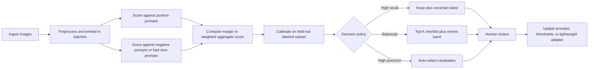

> **Status:** External research snapshot (not a product spec).
> **Source:** Ingested from deep-research-report (10).md, 2026-05-23.
> **Note:** Inline Deep Research citation markers were removed. Verify metrics against primary papers before external citation.

## Relation to Vexlum Scoring

- **Canonical roadmap:** [MODEL_RECOMMENDATIONS_PIPELINES.md](../MODEL_RECOMMENDATIONS_PIPELINES.md)
- **Similarity clustering / stacks:** [04-clustering-culling-stacks.md](../features/implemented/04-clustering-culling-stacks.md), [CULLING_FEATURE.md](../technical/CULLING_FEATURE.md)
- **Quality scoring (MUSIQ, TOPIQ, etc.):** [02-scoring-and-models.md](../features/implemented/02-scoring-and-models.md), [DEEP_RESEARCH_REPORT.md](DEEP_RESEARCH_REPORT.md)
- **Auto-culling landscape:** [AUTO_CULLING_ALGORITHMS_RESEARCH_2026-05-23.md](AUTO_CULLING_ALGORITHMS_RESEARCH_2026-05-23.md)
- **Proposed adaptive hierarchical design:** [SMART_CULLING_ADAPTIVE_HIERARCHICAL_DESIGN.md](../planning/refactoring/SMART_CULLING_ADAPTIVE_HIERARCHICAL_DESIGN.md)

| Related report | Topic |
|----------------|-------|
| [DEEP_RESEARCH_REPORT.md](DEEP_RESEARCH_REPORT.md) | IQA model selection (QualiCLIP, TOPIQ, ARNIQA) |
| [AUTO_CULLING_ALGORITHMS_RESEARCH_2026-05-23.md](AUTO_CULLING_ALGORITHMS_RESEARCH_2026-05-23.md) | Industry auto-culling algorithms |

---

# Comparing CLIP Models for Image Scoring and Culling Workflows

## Executive summary

For image scoring and culling, the practical choice is usually not “the best CLIP model in the abstract,” but the best model for your scoring regime: English-only versus multilingual prompting, coarse semantic filtering versus fine ranking, and offline batch culling versus low-latency streaming. The strongest high-confidence conclusions from the primary sources are these.

OpenAI CLIP remains the cleanest reference baseline: it introduced the dual-encoder recipe, used both ResNet and ViT image towers, learned scaled cosine similarities, and showed unusually strong zero-shot robustness under natural distribution shift. Its public model cards and configs make it easy to reason about prompt behavior, normalization, and deployment, but OpenAI did not release the WIT-400M pretraining dataset, and the official docs reviewed here do not provide a standardized inference-latency matrix across CPU, GPU, and TPU.

OpenCLIP is the most useful open-weight workhorse family for production experimentation. The scaling-law paper and official repo show that, as model and data scale increase, OpenCLIP improves not just ImageNet zero-shot accuracy but also robustness benchmarks and zero-shot retrieval. The same paper provides the most useful cross-model deployment proxies in the source set: parameter counts, embedding widths, and GMACs for ViT-B/32 through ViT-G/14. For retrieval-heavy scoring pipelines, OpenCLIP pretrained on LAION data has a stronger scaling trend than OpenAI CLIP pretrained on WIT, even though OpenAI WIT models still have an advantage on zero-shot ImageNet-style classification.

MetaCLIP materially changes the data story. The MetaCLIP paper isolates data curation as the key variable and reports that at matched ViT scales, metadata-curated CommonCrawl data outperforms CLIP’s original WIT data on standard zero-shot benchmarks, including 70.8% versus 68.3% on ViT-B and 80.5% on ViT-H at larger scale. MetaCLIP 2 then extends this to multilingual training, using worldwide data and multilingual tokenization, and reports state-of-the-art multilingual results without changing the core CLIP recipe as drastically as some alternatives. If non-English prompts are a first-class requirement, MetaCLIP 2 is the strongest family in the sources reviewed.

For culling specifically, the single most important scoring recommendation is to treat raw CLIP similarity as a ranking signal first and a calibrated probability only after task-specific calibration. CLIP itself uses normalized embeddings and scaled cosine similarity; later calibration work shows that calibration varies materially by architecture, pretraining data, prompt set, and distribution shift, while temperature scaling can improve reliability and sometimes transfers from in-distribution calibration to OOD test sets. In practice, normalized cosine similarity should be the default metric for cross-image ranking and threshold tuning; softmax should be reserved for closed candidate sets because it depends on the competing prompts in that batch.

For deployment, there is no primary-source, apples-to-apples benchmark table for end-to-end CPU, GPU, and TPU inference across the main CLIP families in the sources reviewed. The best published proxies are model size, GMACs, checkpoint size, and Hub-reported memory requirements. Those proxies are still decisive enough for selection: ViT-B/32 is the low-cost baseline, ViT-B/16 is a common sweet spot, ViT-L/14 is the quality-first choice when English prompting is enough, and OpenCLIP or MetaCLIP H/14-class models are the right defaults when retrieval quality or multilingual behavior matters more than latency.

## Model families and data foundations

CLIP’s core design is a dual encoder: an image encoder and a text encoder, each projected into a shared embedding space, with training driven by scaled pairwise cosine similarities between matched image-text examples. OpenAI’s original paper explicitly describes two image-encoder branches, a modified ResNet line and a Vision Transformer line, while the text encoder is a masked self-attention Transformer. The published OpenAI repository exposes the inference behavior directly: `model(image, text)` returns similarities equivalent to cosine similarity times a learned scale.

OpenAI CLIP trained on the private WIT dataset, which the paper describes as about 400 million image-text pairs collected from public internet sources using roughly 500,000 queries and approximate balancing across queries. The repository is MIT-licensed, but the dataset itself was not released, so downstream users cannot independently audit or re-license the training corpus. The OpenAI model card also explicitly limits intended use and says the model had not been purposefully trained in or evaluated on languages other than English.

OpenCLIP keeps the CLIP recipe but swaps in open data and open training code. The official repo and scaling-law paper document training on LAION-400M, LAION-2B, and DataComp-derived sets, and the repository is MIT-licensed. LAION-5B’s official announcement states that the metadata dataset is distributed under CC-BY 4.0, while underlying image rights remain with original web sources; this is valuable for reproducibility, but it is not a blanket relicensing of every underlying image. OpenCLIP also publishes multilingual variants that replace the original English text tower with RoBERTa or XLM-Roberta text encoders, and one large multilingual checkpoint is trained in a LiT-style regime with a frozen English image tower and an unfrozen multilingual text tower.

MetaCLIP’s contribution is not a new loss function but a new data curation story. The MetaCLIP paper argues that data curation is the main ingredient behind CLIP performance, rebuilds a CLIP-like metadata pipeline over CommonCrawl, and reports stronger zero-shot results than CLIP and LAION at matched settings. The MetaCLIP repository says the family largely adheres to OpenAI CLIP’s training and model setup, and its public code and weights are primarily CC-BY-NC. MetaCLIP 2 then adds worldwide data curation and multilingual tokenization, using `facebook/xlm-v-base` for its main worldwide checkpoints and reporting that multilingual expansion no longer needs to degrade English performance.

A useful way to think about the text side is this: OpenAI CLIP is primarily an English semantic matcher; OpenCLIP gives you both English and multilingual text-tower options; MetaCLIP 2 is the family most explicitly optimized for multilingual prompting and retrieval in the official materials reviewed here. For culling workflows driven by English rubric prompts such as “a sharp, well-composed portrait” or “a blurry out-of-focus shot,” English CLIP families are sufficient. For multilingual asset libraries, cross-border e-commerce, or non-English keyword workflows, the multilingual OpenCLIP variants and especially MetaCLIP 2 deserve priority.

### Representative family comparison

| Family and representative variant | Image encoder | Text encoder | Pretraining data | Openness and licensing | Published size and embedding notes | Best fit for culling |
|---|---|---|---|---|---|---|
| OpenAI CLIP ViT-B/32 | ViT-B/32 | English masked self-attention Transformer | WIT-400M private web image-text pairs | Repo and weights under MIT; dataset not released; English-only use is the stated safe scope | OpenAI config exposes 512-d projection and 12-layer text tower; architecture-matched ViT-B/32 is 151M params and 7.40 GMAC in OpenCLIP’s scaling table. | Lowest-friction baseline for English semantic triage |
| OpenAI CLIP ViT-L/14 | ViT-L/14 | English masked self-attention Transformer | WIT-400M private | Repo and weights under MIT; dataset private | Official Hub page reports 0.4B params; config exposes 768-d projection; architecture-matched ViT-L/14 is 428M params and 87.73 GMAC in the OpenCLIP scaling paper. | Strong English quality-first scoring when latency is secondary |
| OpenAI CLIP ResNet family | Modified ResNet-50 baseline, scaled through larger RN variants | English Transformer | WIT-400M private | MIT repo; dataset private | The original paper explicitly includes a ResNet family and scaled ResNet variants, but exact per-checkpoint parameter and retrieval metrics were not consistently exposed in the sources reviewed here. | Historical CNN baselines; useful mainly if your stack strongly prefers conv backbones |
| OpenCLIP ViT-B/32 LAION-2B | ViT-B/32 | English CLIP text tower | LAION-2B English subset | Repo MIT; model card MIT; LAION metadata CC-BY 4.0 | 151M params, 512-d embeddings, 7.40 GMAC by architecture table; official repo reports 65.62% zero-shot ImageNet for a LAION-2B B/32 run. | Best low-cost open baseline for semantic ranking and retrieval-heavy use |
| OpenCLIP ViT-H/14 LAION-2B | ViT-H/14 | English CLIP text tower | LAION-2B English subset | Repo MIT; model card MIT | 986M params, 1024-d embeddings, 190.97 GMAC; checkpoint file is about 3.94 GB in full precision. | Strongest open English retrieval/scoring option in the classic CLIP family |
| OpenCLIP multilingual variants | ViT-B/32 or ViT-H/14 image towers | RoBERTa, XLM-Roberta, or frozen XLM-R large variants | LAION-2B or LAION-5B multilingual | OpenCLIP repo MIT; individual model cards vary | Official repo documents XLM-R variants and multilingual gains on translated ImageNet prompts, though exact retrieval numbers vary by checkpoint. | Non-English prompt-driven ranking without leaving the OpenCLIP ecosystem |
| MetaCLIP ViT-B/32 400M | ViT-B/32-style model closely following CLIP setup | CLIP-style text tower | Metadata-curated CommonCrawl, 400M pairs | Repo and models CC-BY-NC | Official paper reports 70.8% zero-shot ImageNet; official model card does not expose a stable exact parameter count, but the architecture follows the CLIP B/32 setup. | Better curated English scoring when you value data quality over permissive licensing |
| MetaCLIP ViT-H/14 2.5B | ViT-H/14-style model | CLIP-style text tower | Metadata-curated CommonCrawl, 2.5B-scale training | CC-BY-NC | Official Hub page reports 1.0B params; paper reports 80.5% zero-shot ImageNet. | Very strong large-scale English scoring with curated data |
| MetaCLIP 2 ViT-H/14 worldwide | ViT-H/14 | `facebook/xlm-v-base` | Worldwide web-scale data, 29B seen pairs | Repo primarily CC-BY-NC | Repo lists multilingual tokenizer; paper reports 57.4 CVQA-LOCAL zero-shot and 64.3 XM3600 image-to-text retrieval, with +0.8 ImageNet over the English-only counterpart. | Best fit when multilingual prompts and retrieval matter materially |

A subtle but important implication for culling is that “CLIP family” choice is as much a text-encoder choice as an image-encoder choice. English-only culling can often be solved by a better prompt bank on a mid-sized model; multilingual culling usually benefits more from the right text tower than from moving from B/32 to L/14 in the same English-only family.

## Performance evidence on retrieval, ranking, and robustness

The cleanest cross-family evidence set available in the sources reviewed here is still zero-shot, not fine-tuned. OpenAI’s original paper and repository emphasize zero-shot transfer, promptable classification, and linear-probe evaluation. OpenCLIP’s scaling-law paper adds the most rigorous open comparison for retrieval. MetaCLIP’s paper focuses on the effect of data curation on zero-shot classification. As a result, zero-shot retrieval and ranking are much easier to compare consistently than fine-tuned ranking behavior.

### Published zero-shot comparison across representative variants

| Model | Zero-shot ImageNet top-1 | MS-COCO image retrieval R@5 | MS-COCO text retrieval R@5 | Flickr30K image retrieval R@5 | High-confidence interpretation |
|---|---:|---:|---:|---:|---|
| OpenAI CLIP ViT-B/32 | 68.33% | Unspecified in the primary sources reviewed | Unspecified | Unspecified | Strong English zero-shot classifier baseline; WIT data gives a classification advantage over similarly scaled open-data models. |
| OpenAI CLIP ViT-L/14 | 75.54% | Unspecified | Unspecified | Unspecified | High-quality English semantic scorer; stronger ImageNet-oriented scaling than open-data OpenCLIP counterparts. |
| OpenCLIP ViT-B/32 LAION-2B | 65.63% | 79.58 | 88.26 | 96.10 | Better retrieval trade-off than OpenAI B/32-class WIT models; good low-cost culling backbone |
| OpenCLIP ViT-L/14 LAION-2B | 75.26% | 84.00 | 92.92 | 98.70 | Strong balanced open model for high-quality semantic ranking |
| OpenCLIP ViT-H/14 LAION-2B | 77.95% | 86.04 | 94.10 | 99.30 | Best classic open-weight retrieval checkpoint in this evidence set |
| MetaCLIP ViT-B/32 400M | 70.8% | Unspecified | Unspecified | Unspecified | Better than CLIP’s published ViT-B result in the MetaCLIP paper; suggests data curation alone materially improves semantic scoring quality |
| MetaCLIP ViT-H/14 2.5B | 80.5% | Unspecified | Unspecified | Unspecified | Best English-only zero-shot ImageNet result among the CLIP-like families explicitly compared in the sources reviewed |
| MetaCLIP 2 ViT-H/14 worldwide | English-only counterpart +0.8 on ImageNet | XM3600 image-to-text 64.3 | Unspecified in the cited abstract excerpt | Unspecified | Strongest multilingual choice in the official sources reviewed |

For ranking-style scoring, the most relevant published paper in the source set is CLIPScore. It shows that CLIP-based image-text compatibility can correlate strongly with human judgments on literal image-caption compatibility and can outperform several traditional reference-based metrics, but it is weaker on tasks that require context not visible in the image, such as news captions. For culling, that is a very important boundary condition: CLIP is often good at literal semantic fit, technical defect proxies, and content matching, but not inherently a universal judge of aesthetics or story-level value unless you fine-tune or add human feedback.

Prompt sensitivity is not a side issue; it is central. OpenAI’s prompt repository shows that the paper’s zero-shot evaluations relied on template sets, not bare class names, and a later robustness study found that reducing the prompt set from the 80-prompt reference changes accuracy, OOD detection, and calibration behavior. In a culling workflow, this means that a one-line prompt such as “a good photo” is almost always the wrong baseline. You should use a prompt bank that reflects your rubric and your domain.

Robustness to shift is one of CLIP’s biggest real advantages for culling. The original OpenAI paper reports that zero-shot CLIP improves effective robustness under natural distribution shifts and can reduce the gap between ImageNet accuracy and shifted-data accuracy by up to 75%. OpenCLIP’s scaling paper then shows that improvements in zero-shot ImageNet accuracy from scale are accompanied by aligned improvements on robustness benchmarks. Later analysis adds nuance: CLIP models tend to be more robust than standard models on factors such as subcategory, smaller objects, color, shape, texture, and larger objects, but weaker on some factors such as pose and partial view; training source also changes these factor-level behaviors.

Fine-tuned comparisons are much thinner and much less apples-to-apples. OpenAI’s repository shows linear-probe evaluation as the canonical simple adaptation path. Later robustness work finds that fine-tuned CLIP models often improve classification accuracy and may improve calibration relative to their zero-shot counterparts, but they do not preserve every zero-shot robustness advantage automatically. In the sources reviewed here, there is no single primary-source table that compares fine-tuned OpenAI CLIP, OpenCLIP, and MetaCLIP on the same retrieval or ranking protocol, so fine-tuned family-level rankings should be treated as unspecified rather than guessed.

## Efficiency and deployability

The primary sources reviewed here do **not** provide a standardized benchmark table for end-to-end latency or throughput on CPU, GPU, and TPU for the main CLIP families on the same hardware and software stack. That absence is itself important: if latency is a hard requirement, you should budget one benchmarking pass rather than choosing on benchmark folklore. What the literature does provide is good proxy information: parameter counts, GMACs, checkpoint sizes, and memory estimates under different precisions.

### Deployment proxies that matter in practice

| Architecture proxy | Params | Embedding dim | GMAC per image | Memory and checkpoint evidence | Practical implication |
|---|---:|---:|---:|---|---|
| ViT-B/32 | 151M | 512 | 7.40 | OpenAI B/32 full-precision inference size about 577 MB, fp16 about 289 MB, int8 about 144 MB, int4 about 72 MB; official checkpoint file about 605 MB. | Best starting point for cheap semantic prefiltering and live-preview scoring |
| ViT-B/16 | 150M | 512 | 20.57 | No same-quality official memory table was retrieved for this exact checkpoint, but compute is about 2.8× B/32 while parameter count stays similar. | Often the best “sweet spot” if you can afford more image-token compute |
| ViT-L/14 | 428M | 768 | 87.73 | OpenAI ViT-L/14 Hub page reports 0.4B params; memory utility shows about 1.59 GB float32, 816 MB fp16, 408 MB int8, 204 MB int4. | Strong quality-first default for English culling on modern GPUs |
| ViT-H/14 | 986M | 1024 | 190.97 | OpenCLIP and MetaCLIP H/14 checkpoints are about 3.94 GB in full precision; MetaCLIP Hub page reports 1.0B params. | Excellent retrieval and multilingual quality, but usually too large for low-cost streaming |
| ViT-g/14 | 1.37B | 1024 | 290.74 | Scaling-law paper reports the architecture but the official deployment sources reviewed here do not provide a uniform memory table. | Niche quality-max choice when batch throughput matters more than latency |
| ViT-G/14 | 2.54B | 1280 | 532.92 | Architecture-only proxy in the scaling-law paper. | Usually excessive for culling unless you are building a large-scale retrieval backend |

The most reliable inference from these numbers is simple: throughput will track GMACs and checkpoint size closely enough for first-pass architecture choice. ViT-B/32 is the economical option. ViT-B/16 buys better patch granularity without a parameter explosion. ViT-L/14 is the first model that feels “quality first” rather than “budget first.” H/14-class models are justified when retrieval accuracy, multilingual prompting, or long-tail semantic nuance materially affects business value.

Quantization support is real, but the evidence is uneven. OpenAI CLIP’s public Hub pages show multiple quantized derivatives and automated memory estimates down to int4, which is enough to say that post-training quantized deployment is supported by the broader ecosystem. What the primary family papers generally do **not** report is a standardized retrieval-accuracy drop after quantization, so you should assume quantization requires revalidation on your scoring task. Pruning support is even less standardized in the official model docs reviewed here; it is better treated as implementation-specific rather than as a family-level differentiator.

One further operational point: OpenCLIP’s official repo reports training hardware in A100 counts and GPU-hours for many checkpoints, but those are training disclosures, not deployment guarantees. Because the same model can behave very differently under PyTorch eager execution, Torch compile, ONNX Runtime, TensorRT, OpenVINO, or TPU/XLA wrappers, the lack of standardized official latency numbers should be read as a signal to benchmark, not as a gap you can safely ignore.

## Scoring and culling workflow design

The safest default scoring rule is **L2-normalized cosine similarity** between image and text embeddings. That is not just a convenience choice; it matches the CLIP objective and the official code paths. OpenAI’s pseudocode and repository normalize both modalities before computing logits, and the common inference examples in OpenAI and OpenCLIP multiply normalized dot products by a fixed factor before optionally applying softmax. In other words, normalized dot product and cosine are the same once the embeddings are normalized, and that is usually the right representation for ranking.

**Dot product without normalization** is only sensible if you are intentionally preserving norm information or reconstructing model-native logits for a closed prompt set. For culling, that is usually a bad trade because it makes thresholds less portable across batches, prompt banks, and sometimes even preprocessing changes. **Softmax** should be treated as a *within-candidate-set* probability transform, not an absolute confidence score, because the probability changes when you change the prompt pool. That is acceptable for “pick the best of these five labels,” but risky for “discard this photo if the score is under 0.32.”

A practical production pattern is to score against both positive and negative prompts. For instance, for portrait culling, you might combine positive prompts such as “a sharp, well-composed portrait,” “a well-lit face,” and “a subject with eyes in focus,” with negative prompts such as “a blurry out-of-focus portrait,” “a badly exposed portrait,” or “a subject blinking.” The operational score is then a margin, not a raw similarity. This recommendation is an engineering inference from the way CLIP scores behave under prompt dependence and calibration drift, and it is usually much more stable than a single positive prompt alone. The same principle applies if you use exemplar images rather than text prompts.

Threshold selection should follow the business cost of mistakes. If your primary goal is **not discarding keepers**, false negatives are more expensive than false positives, so the first pass should be recall-oriented: keep the uncertain middle band and send it to human review. If your primary goal is producing a **small shortlist** from a very large archive, then precision and ranking quality matter more, and top-*K*, NDCG, or percentile-based cutoffs are often preferable to absolute thresholds. Because calibration varies by prompt set, dataset, and architecture, thresholds should be tuned on a small human-labeled validation slice from your own workflow rather than copied from a paper or a blog post.

Batching strategy also matters. For **offline shoot culling**, batch mode is generally superior because you can compute stable percentiles, margins, deduplicate embeddings, and apply score normalization within a coherent shoot. For **streaming or tethered capture**, you care about p50 latency, so a small prompt bank and a B/32-class or B/16-class model are usually better engineering defaults. This is an engineering recommendation rather than a published benchmark result, but it follows directly from the compute and memory differences across architectures.

Human-in-the-loop review should be considered mandatory for any consequential or customer-facing culling system. OpenAI’s own model card says deployed use is out of scope without task-specific testing and warns that class taxonomy choices materially change behavior and bias. That warning transfers directly to culling: if your rubric includes subjective or socially loaded notions such as “professional,” “premium,” or “beautiful,” human review is not optional; it is part of the system.



The strongest cost-performance pattern from the evidence is straightforward. If you need a cheap semantic pass, start with ViT-B/32. If you want a better quality-per-dollar trade, use ViT-B/16 or ViT-L/14. If zero-shot retrieval quality or multilingual prompting is core, move to OpenCLIP H/14 or MetaCLIP 2 H/14. If your scoring target is aesthetic or editorial rather than literal semantic fit, do not assume a larger zero-shot CLIP family will solve it; add human-labeled calibration data and, if needed, a lightweight fine-tuning stage.

## Reproducible evaluation

A reproducible evaluation stack for CLIP-based culling should combine standard public benchmarks with a small in-domain dataset that reflects your actual reject/keep rubric. Public benchmarks should cover three things: general zero-shot semantics, retrieval ranking, and robustness. ImageNet remains the canonical zero-shot classification benchmark; MS-COCO and Flickr30K remain the core image-text retrieval benchmarks; and the shift datasets used in the CLIP literature—ImageNet-V2, ImageNet-A, ImageNet-R, ImageNet-Sketch, and ObjectNet—cover robustness under natural distribution changes.

For a culling-specific validation set, a simple but defensible protocol is this. Sample several shoots or folders. Ask one or more human reviewers to assign labels such as **keeper**, **maybe**, **reject**, plus reason tags like **blur**, **bad crop**, **duplicate**, **wrong subject**, or **good composition**. Then evaluate both semantic prompt scores and exemplar-based scores. The key metrics should be recall at the reject threshold, precision at top-*K*, ROC-AUC or PR-AUC for binary keeper/reject decisions, Kendall’s tau or Spearman correlation if you turn the task into ranking, and ECE or NLL if you calibrate probabilities rather than only ranks. The calibration literature reviewed here specifically uses ECE and NLL, and those are the right diagnostics if you want threshold stability rather than just ranking quality.

A strong minimal benchmark grid is:

| Dimension | Recommendation | Why it matters |
|---|---|---|
| Zero-shot semantics | ImageNet class prompts and your own domain prompts | Confirms broad semantic alignment and prompt sensitivity |
| Retrieval ranking | MS-COCO and Flickr30K Recall@K | Matches CLIP’s native cross-modal ranking objective |
| Robustness | ImageNet-V2, ImageNet-A, ImageNet-R, ImageNet-Sketch, ObjectNet | Exposes shift behavior that often appears in real culling jobs |
| Calibration | ECE, NLL, temperature-scaled ECE/NLL | Raw similarities are not reliably portable across prompts and domains |
| Systems | p50/p95 latency, images/sec, peak RAM/VRAM, batch scaling | Primary papers under-report deployment latency, so you need your own hardware readout |

A minimal reproducible scorer using the official OpenCLIP-style interface looks like this:

```python
import torch
import open_clip
from PIL import Image
from pathlib import Path

device = "cuda" if torch.cuda.is_available() else "cpu"
model_name = "ViT-B-32"
pretrained = "laion2b_s34b_b79k"

model, _, preprocess = open_clip.create_model_and_transforms(model_name, pretrained=pretrained)
tokenizer = open_clip.get_tokenizer(model_name)
model = model.eval().to(device)

positive_prompts = [
"a sharp, well-composed portrait",
"a technically clean photo",
"a photo with the main subject in focus",
]

negative_prompts = [
"a blurry out-of-focus photo",
"a badly exposed photo",
"a poorly framed photo",
]

all_prompts = positive_prompts + negative_prompts
text = tokenizer(all_prompts).to(device)

with torch.no_grad():
text_features = model.encode_text(text)
text_features = text_features / text_features.norm(dim=-1, keepdim=True)

def score_image(path: str, neg_weight: float = 0.7) -> dict:
image = preprocess(Image.open(path).convert("RGB")).unsqueeze(0).to(device)
with torch.no_grad():
image_features = model.encode_image(image)
image_features = image_features / image_features.norm(dim=-1, keepdim=True)

sims = (image_features @ text_features.T).squeeze(0) # cosine similarities
pos = sims[:len(positive_prompts)].mean().item()
neg = sims[len(positive_prompts):].mean().item()
margin = pos - neg_weight * neg

return {
"path": path,
"positive_score": pos,
"negative_score": neg,
"margin_score": margin,
}

# Example batch scoring
results = [score_image(str(p)) for p in Path("images").glob("*.jpg")]
results = sorted(results, key=lambda x: x["margin_score"], reverse=True)
```

This code intentionally uses normalized cosine similarity and a positive-minus-negative margin because those choices align best with the CLIP objective and with the calibration evidence. Official reference implementations and repos to anchor a reproducible setup are OpenAI CLIP, OpenCLIP, MetaCLIP, and CLIPScore.

## Recommendations and limitations

If your workflow is **English-only, cost-sensitive, and primarily about rejecting obvious misses**, start with **OpenCLIP ViT-B/32** or **OpenAI CLIP ViT-B/32**. OpenCLIP gives better open-data retrieval evidence and cleaner scaling tables; OpenAI CLIP remains the reference baseline with strong robustness behavior and widely understood prompting.

If your workflow is **quality-sensitive and still mostly English**, start with **ViT-L/14**. OpenAI ViT-L/14 is a strong English semantic scorer with an official 0.4B-parameter Hub release; OpenCLIP ViT-L/14 on LAION-2B adds stronger published retrieval numbers and a more open training story.

If your workflow is **retrieval-heavy, ranking-heavy, or long-tail semantic**, and latency is not the main constraint, the best-supported choice in the evidence reviewed here is **OpenCLIP ViT-H/14 LAION-2B**. It has the strongest published MS-COCO and Flickr30K retrieval results among the classic open CLIP-family checkpoints in the sources gathered, and its architecture table gives a transparent deployment-cost proxy.

If your workflow is **multilingual**, prioritize **MetaCLIP 2** first and multilingual **OpenCLIP XLM-R** checkpoints second. The official MetaCLIP 2 materials explicitly target worldwide data, use multilingual tokenization, and report strong multilingual benchmark gains without sacrificing English the way many multilingual systems historically did.

If your workflow depends on **aesthetic judgment, editorial quality, or brand taste**, do not rely on raw zero-shot CLIP alone. The best-supported usage of CLIP in the source set is literal image-text compatibility; subjective ranking needs a human-labeled calibration slice and, often, lightweight fine-tuning or an adapter layer.

The main limitations of this report are also the main limitations of the literature. Standardized **CPU/GPU/TPU inference latency and throughput** are mostly unspecified in the primary source set reviewed. **Fine-tuned retrieval and ranking** comparisons across OpenAI CLIP, OpenCLIP, and MetaCLIP are not reported in a single apples-to-apples benchmark table. And for several checkpoints—especially some MetaCLIP and ResNet variants—official public pages expose architecture and usage more reliably than exact parameter and memory breakdowns. Where that happened, this report either marked the metric as unspecified or used clearly labeled architecture-matched proxies rather than inventing missing values.