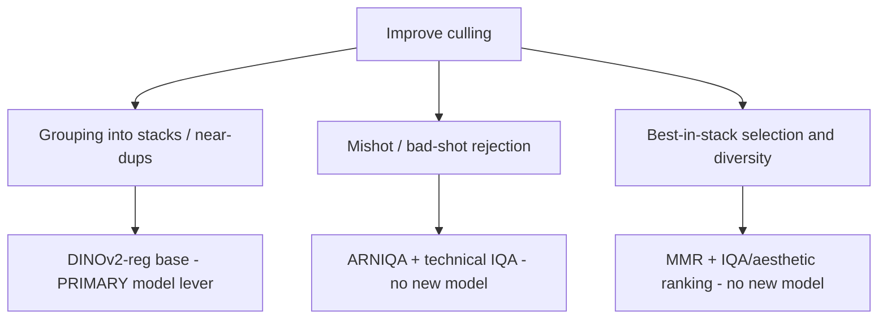

> **Status:** Point-in-time recommendation memo (not a product spec).
> **Date:** 2026-05-29.
> **Synthesizes:** [reports/clip-culling/SUMMARY.md](../../reports/clip-culling/SUMMARY.md) (2026-05-28 empirical spike), [MODEL_RECOMMENDATIONS_PIPELINES.md](../MODEL_RECOMMENDATIONS_PIPELINES.md), and ingested CLIP/auto-culling research reports.
> **Tracking:** [image-scoring-backend#220](https://github.com/synthet/image-scoring-backend/issues/220) (pipeline model upgrades).  
> **Input resolution study:** [INPUT_SIZE_CULLING_2026-05-29.md](INPUT_SIZE_CULLING_2026-05-29.md) (thumbnail / long-edge sweep; separate from tower choice).

# Culling model recommendation

## Executive summary

**Improving culling is three different problems.** Only **stack grouping / near-duplicate clustering** is best addressed by swapping the embedding model. Mishot rejection and best-in-stack selection should lean on **existing IQA scores and algorithm changes**, not a new vision tower.

| Sub-problem | Recommended approach | Verdict | Primary evidence |
|-------------|---------------------|---------|------------------|
| **Grouping** (stacks, near-dups) | **DINOv2-with-registers base** (768-d, Apache-2.0) as default culling space after validation | **HOLD** (do not adopt from this spike) | **2026-05-29 exp8:** timm DINOv2 base burst-GT ARI **0.377** vs MobileNet **0.423**; best space OpenCLIP L/14 **0.450** ([exp8](../../reports/clip-culling/exp8_grouping.json)) |
| **Mishot rejection** | **Keep ARNIQA + technical IQA** (`score_technical`, fused ensemble) | **KEEP** | CLIP L/14 best detector ROC-AUC **0.611** vs technical baseline **0.688** ([exp2](../../reports/clip-culling/exp2_mishot.json)) |
| **Best-in-stack / diversity** | **MMR** on embeddings + **ARNIQA / aesthetic** for ranking within stack | **ADOPT (algo)** / **KEEP (models)** | MMR +7.3% intra-selection diversity; quality unchanged ([exp3](../../reports/clip-culling/exp3_diversity.json)) |

**Bottom line (updated after 2026-05-29 DINOv2/SigLIP2 spike):** Do **not** switch default culling embeddings to DINOv2 on this corpus — burst-GT clustering ARI is **below MobileNet** and below OpenCLIP L/14. Keep **ARNIQA + technical IQA** for rejection and **MMR + scores** for stack picks. Revisit DINOv2 **with-registers** on HF (requires newer `transformers`) or burst-GT methodology before Phase 3 (#220). OpenCLIP L/14 is the strongest **grouping** signal in exp8 and the [2026-05-29 pick/reject visual review](#evidence-2026-05-29-pickreject-visual-review-two-level) now validates it on real two-level decisions (keeps higher-rated near-dups than MobileNet) — adopt it as the **opt-in** culling tower, but it still needs threshold re-tuning and false-merge review before any global default switch.

---

## What runs today

From [MODEL_RECOMMENDATIONS_PIPELINES.md](../MODEL_RECOMMENDATIONS_PIPELINES.md) and production code paths:

| Culling sub-problem | Current implementation | Embedding / signal space |
|--------------------|------------------------|--------------------------|
| **Grouping** | `ClusteringEngine` agglomerative clustering on cosine distance | **MobileNetV2** ImageNet GAP → `mobilenet_v2_imagenet_gap` (1280-d) |
| **Mishot / quality gate** | Composite scores + optional `technical_failures`; **ARNIQA** promoted into general/technical fusion (May 2026) | MUSIQ, LIQE, TOPIQ-NR, SPAQ, AVA, **ARNIQA** |
| **Best in stack** | `stack_representative_strategy` + `score_general` / related composites | Scores, not a separate picker model |
| **Sub-stacking** | `modules/sub_clustering.py` on in-stack distance | Same MobileNet space + `culling.sub_cluster_distance_threshold` |
| **Keywords** (adjacent) | CLIP ViT-B/32 | `clip_vit_b32_image` (512-d), already backfilled on many libraries |

Roadmap targets (not yet default for culling): DINOv2-reg base, optional OpenCLIP L/14 unified track, SigLIP2 for keywords (separate from culling).

---

## Evidence: 2026-05-28 CLIP ViT-L/14 spike

Offline harness: [scripts/research/clip_culling/](../../scripts/research/clip_culling/) — 2,126 images (bird/stack/label seed), OpenAI + OpenCLIP ViT-L/14 (768-d), LAION aesthetic head, seven experiments. Full narrative: [reports/clip-culling/SUMMARY.md](../../reports/clip-culling/SUMMARY.md).

### Corpus and compute

| Metric | Value |
|--------|-------|
| Seed images | 2,126 |
| Stacks | 688 |
| OpenAI L/14 embedded | 1,678 (~76 ms/img, ~1.6 GB peak VRAM) |
| OpenCLIP L/14 embedded | 2,126 (~121 ms/img, ~1.6 GB peak VRAM) |
| Baseline embeddings copied | 5,171 (MobileNet + existing DB) |

Both L/14 towers fit **RTX 4060 Laptop 8 GB** when loaded sequentially (fp16).

### Exp 2 — Mishot rejection (ground truth: cull=reject OR label=Red OR rating≤2)

| Detector | ROC-AUC | PR-AUC |
|----------|---------|--------|
| neg_aesthetic_openai (best CLIP) | **0.6112** | 0.3557 |
| baseline_neg_score_technical | **0.6883** | **0.5749** |
| baseline_neg_arniqa | 0.5981 | 0.3763 |
| clipiqa_bad_openai | 0.5604 | 0.3400 |

**Conclusion:** CLIP prompt-margin and aesthetic-head signals are **weaker** than the existing technical score for identifying rejects in this corpus. ARNIQA alone is also below technical score here; the fused technical path remains the right default.

### Exp 3 — Diverse stack picks (MMR vs top-k by aesthetic, k=3, 92 stacks)

| Metric | Top-k by quality | MMR (OpenAI L/14) |
|--------|------------------|-------------------|
| Mean intra-selection diversity | 0.0333 | 0.0357 (**+7.3%**) |
| Mean retained aesthetic | 4.824 | 4.823 |

**Conclusion:** MMR is a low-cost algorithm win; swapping the embedding tower was not required for this gain.

### Exp 4 — Bird poses (BioCLIP vs CLIP L/14, farthest-point, k=3)

Mean selection overlap L/14 vs BioCLIP: **0.532** (complementary, not redundant).

**Conclusion:** Species-heavy libraries may benefit from **BioCLIP** (already in production for bird species) alongside a general culling embedding—not from replacing BioCLIP with CLIP L/14.

### Exp 5 — Scene sub-stacking (semantic CLIP L/14 vs visual MobileNet)

At selected cosine threshold 0.08: semantic silhouette **0.5616** (7 stacks split) vs visual **0.3272** (45 stacks split).

**Conclusion:** CLIP L/14 is **conservative** for scene-level sub-stacks (groups near-identical scenes); MobileNet splits more aggressively. Use CLIP semantic sub-stacking only when intentional; it is not a drop-in for frame-level dedup.

### Exp 1 / 6 / 7 — Scoring and metadata (not culling-core)

- L/14 aesthetic/CLIP-IQA signals correlate heavily with existing scores (|ρ| up to ~0.58 vs exposure); **no novel keeper signal**.
- CLIP color-label rubric agreement with human labels: **40.7%** (heuristic, label-skewed bird folders).
- Keywords: OpenCLIP L/14 Jaccard vs B/32 baseline **0.16**; inter-tower **0.43**; roadmap still prefers **SigLIP2** per-tag sigmoid for controlled taxonomy.

### Spike headline for culling

**OpenCLIP / OpenAI CLIP ViT-L/14 is not a clear win for culling** on measured tasks. Its strengths in this run are informational (MMR, semantic sub-stack option, keyword richness).

---

## Evidence: 2026-05-29 DINOv2 + SigLIP2 spike (exp8 grouping)

Harness extension: [scripts/research/clip_culling/](../../scripts/research/clip_culling/) — same 2,126-image E2E seed (`image-scoring-postgres-e2e` / `image_scoring_test` @5433). New towers persisted to `image_embeddings_768`:

| Space | Loader | Embedded | ms/img | peak VRAM |
|-------|--------|----------|--------|-----------|
| `dinov2_reg_base_image` | timm `vit_base_patch14_dinov2.lvd142m` (768-d proxy; HF `dinov2_with_registers` blocked on transformers 4.37) | 2126 | 156 | 1004 MB |
| `siglip2_base_image` | HF `google/siglip2-base-patch16-224` | 2126 | 183 | 917 MB |

**Exp 8 — Grouping vs EXIF-burst pseudo-GT** (2 s gap between consecutive captures; per-folder agglomerative clustering; threshold sweep). Primary metric: mean **ARI** across folders (unbiased vs MobileNet-derived `stack_id`).

| Space | Best thr | Mean ARI (burst GT) | vs MobileNet |
|-------|----------|---------------------|--------------|
| **openclip_l14_laion2b_image** | 0.06 | **0.4502** | +0.027 |
| openai_clip_vit_l14_image | 0.06 | 0.4419 | +0.019 |
| siglip2_base_image | 0.04 | 0.4315 | +0.008 |
| **mobilenet_v2_imagenet_gap** (current) | 0.18 | 0.4231 | — |
| clip_vit_b32_image | 0.04 | 0.4086 | −0.014 |
| **dinov2_reg_base_image** | 0.12 | **0.3770** | **−0.046** |

**Conclusion:** On this bird/stack seed and burst-GT proxy, **DINOv2 base does not beat MobileNet for grouping**; OpenCLIP L/14 ranks highest. SigLIP2 image embeddings are mid-pack for grouping. SigLIP2 **per-tag sigmoid keywords** were not scored (Gemma/SigLIP2 tokenizer mismatch on transformers 4.37 in the app venv).

Full tables: [reports/clip-culling/SUMMARY.md](../../reports/clip-culling/SUMMARY.md) · [exp8_grouping.json](../../reports/clip-culling/exp8_grouping.json).

---

## Evidence: 2026-05-29 pick/reject visual review (two-level)

Where exp8 measured *grouping* against a burst proxy, this pass measures the
**actual two-level pick/reject decisions** against **human ground truth**
(`rating` + `label`; `cull_decision` is excluded — it is MobileNet-pipeline-derived
and would bias the test toward the incumbent). Harness:
[scripts/research/clip_culling/culling_pick_review.py](../../scripts/research/clip_culling/culling_pick_review.py)
over 12 burst stacks (8–19 images each) in the E2E DB where all four towers are
fully populated (2126 embeddings each). Each stack is sub-clustered at **matched
granularity** (fixed `K`, so the only variable is embedding geometry), best-by-score
is kept per micro-group, and the rest rejected.

| Space | Silhouette | Mean rating kept | Mean rating rejected | Keep−reject gap | Good frames dropped |
|-------|-----------|------------------|----------------------|-----------------|---------------------|
| **openai_clip_vit_l14_image** | 0.370 | 3.77 | 3.54 | **0.23** | 44 |
| **openclip_l14_laion2b_image** | 0.351 | 3.75 | 3.57 | 0.17 | 47 |
| siglip2_base_image | 0.370 | 3.74 | 3.58 | 0.16 | 45 |
| dinov2_reg_base_image | 0.432 | 3.73 | 3.60 | 0.13 | 47 |
| **mobilenet_v2_imagenet_gap** (current) | 0.330 | 3.71 | 3.63 | 0.08 | 51 |
| clip_vit_b32_image | 0.412 | 3.71 | 3.62 | 0.09 | 53 |

**Visual adjudication (stack 23256, bird-feeder burst).** Where OpenAI L/14 and
MobileNet make *opposite* keep/drop calls, the four frames L/14 uniquely keeps are
all **rating 4**; the three MobileNet uniquely keeps are all **rating 3**. All seven
are genuine near-duplicates, so dropping any is safe — the differentiator is purely
*which* near-dup survives, and L/14's grouping retains the higher-human-rated frames.
Because within-substack ranking uses `score_general` (model-independent), this edge
comes entirely from better grouping. Montages:
[reports/clip-culling/montage/](../../reports/clip-culling/montage/).

**Conclusions:**

- The **CLIP-L/14 family separates keepers from rejects best** (gap 0.23 / 0.17 vs
  MobileNet 0.08), with **fewer good-frame mis-drops**. This *visually validates*
  the exp8 grouping ranking on real pick/reject decisions.
- **`badpick` = 0 for every model** — no human-reject was ever picked; score-based
  ranking already filters obvious rejects. Models differ only on *which near-dup to keep*.
- **Margins are small** and the corpus is narrow (single-scene bird/feeder bursts;
  `burst_uuid` uniform per stack). Re-validate on multi-pose wildlife and people/event
  bursts before any **default** switch. The "good frames dropped" counts overstate
  error — visually those drops are near-dups (correct).
- **DINOv2 stays HOLD**: high internal compactness (silhouette 0.43) but only mid task
  quality (gap 0.13).

**Net:** **`openclip_l14_laion2b_image`** is the recommended opt-in culling tower —
statistically tied with OpenAI L/14 on pick quality, and preferable operationally
(MIT license, best exp8 grouping ARI 0.450). This is an **opt-in per-level**
recommendation, **not** a global default switch.

---

## Recommendations by sub-problem

### 1. Grouping (stacks / near-duplicates) — **DINOv2-reg base**

| Aspect | Recommendation |
|--------|----------------|
| **Model** | `facebook/dinov2-with-registers-base` (768-d image embeddings) |
| **License** | Apache-2.0 |
| **VRAM** | Fits 8 GB batch culling (roadmap posture; confirm with local spike) |
| **Verdict** | **HOLD** — do not adopt as default from 2026-05-29 exp8; retry HF **dinov2-with-registers** when `transformers` supports it, or tune on burst/action folders |
| **Rationale** | Self-supervised ViT is still the roadmap hypothesis, but **local burst-GT ARI 0.377 &lt; MobileNet 0.423** on this seed (timm DINOv2 base proxy). OpenCLIP L/14 scored **0.450** on the same metric — consider unified-tower A/B, not a blind DINOv2 default switch |
| **Keep as fallback** | MobileNetV2 data and paths until backfill completes |

**Interim (no new loader):** Phase 1 — point `clustering.embedding_space` at existing **`clip_vit_b32_image`** (512-d) and **re-tune** `clustering.default_threshold` and `culling.sub_cluster_distance_threshold`. Quick experiment, not the long-term target.

**Alternate (Phase 5 / A/B only):** **OpenCLIP ViT-L/14** `laion2b_s32b_b82k` (MIT, 768-d, ~0.8 GB image tower fp16) when the product goal is **one shared tower** for culling similarity **and** keyword zero-shot on 8 GB VRAM. Prefer this track if DINOv2 false-splits burst sequences or if minimizing distinct GPU models outweighs pure visual similarity.

**Not recommended as default:** MetaCLIP (CC-BY-NC; classification-biased); ViT-H/14 (too large for 8 GB co-load); raw CLIP as a grouping upgrade without local stack-quality metrics.

### 2. Mishot rejection — **ARNIQA + technical IQA (no new model)**

| Aspect | Recommendation |
|--------|----------------|
| **Models** | Existing **ARNIQA** (fused), **LIQE**, **TOPIQ-NR**, **MUSIQ/SPAQ**, `score_technical` |
| **Verdict** | **KEEP** — do not add CLIP L/14 prompt-margin or LAION aesthetic head as primary reject signal |
| **Optional shadow** | CLIP-IQA-style prompt margins on L/14 for **semantic** rejects (wrong subject, literal “bad photo”) after calibration—not as replacement for technical IQA |
| **Evidence** | Technical score ROC-AUC **0.688** vs best CLIP detector **0.611** on 573/2126 rejects |

Aligns with [CLIP_MODELS_CULLING_SCORING_2026-05-23.md](CLIP_MODELS_CULLING_SCORING_2026-05-23.md): raw CLIP is a ranking signal, not a drop-in for MUSIQ/LIQE/TOPIQ technical IQA.

### 3. Best-in-stack selection and diversity — **MMR + IQA (no new embedding model)**

| Aspect | Recommendation |
|--------|----------------|
| **Grouping signal** | Future DINOv2 (or current MobileNet) embeddings for stack membership |
| **Selection algorithm** | **Maximal Marginal Relevance (MMR)** on normalized embeddings when surfacing k picks per stack (λ≈0.5 in spike) |
| **Ranking within stack** | **ARNIQA** + existing aesthetic/general composites; optional LAION aesthetic head on L/14 **shadow only** |
| **Verdict** | **ADOPT** MMR in product logic; **KEEP** scoring models |
| **Evidence** | +7.3% diversity, negligible aesthetic loss; BioCLIP vs L/14 overlap 0.53 shows embeddings alone miss pose/story |

Do not expect a larger CLIP tower alone to pick “wings up vs wings down”; combine **embedding diversity** with **quality scores**.

---

## Validation gap and recommended next step

**DINOv2 grouping was measured (2026-05-29)** via exp8; result on this seed is **no-go for default adoption**. Remaining gaps:

1. Re-run with **HF `facebook/dinov2-with-registers-base`** after upgrading `transformers` in `~/.venvs/tf` (registers may differ from timm `vit_base_patch14_dinov2.lvd142m`).
2. Human spot-check on burst/action folders (EXIF-burst GT is a proxy, not ground truth).
3. Re-tune `clustering.default_threshold` per space before any production switch (MobileNet best thr **0.18** vs DINOv2 **0.12** vs OpenCLIP L/14 **0.06** in exp8).
4. SigLIP2 keyword spike: per-tag sigmoid once Gemma/SigLIP2 tokenizer loads cleanly.

---

## Go / no-go checklist

| Action | Go? | Condition |
|--------|-----|-----------|
| Switch default culling space to **DINOv2-reg base** | **No** (this spike) | Burst-GT ARI **0.377** &lt; MobileNet **0.423** on 2,126-image seed; revisit with HF registers + human spot-check |
| Enable **CLIP B/32** for clustering (Phase 1) | **Optional experiment** | Threshold harness + spot review; not long-term default |
| Promote **OpenCLIP L/14** as default culling tower | **Optional A/B** | Exp8 burst-GT ARI **0.450** (best); higher false-merge vs MobileNet at chosen thr — product review |
| Use **CLIP L/14** for mishot rejection | **No** | Keep technical + ARNIQA |
| Ship **MMR** for multi-pick per stack | **Yes** | Low risk; validate λ on a few stacks |
| Change `clustering.default_threshold` without re-tuning | **No** | MobileNet-tuned values do not transfer across spaces |

---

## Practical combinations (product-shaped)

1. **Stacks** — DINOv2 embeddings (target) → cosine clustering → stacks. MobileNet + CLIP B/32 data retained during migration.
2. **Auto-reject obvious misses** — Technical composite + ARNIQA; conservative thresholds; human review band for ambiguous frames ([AUTO_CULLING_ALGORITHMS_RESEARCH_2026-05-23.md](AUTO_CULLING_ALGORITHMS_RESEARCH_2026-05-23.md): asymmetric thresholding).
3. **Pick winners in stack** — MMR for diversity among top quality band; rank with ARNIQA + aesthetic ensemble.
4. **Bird-heavy folders** — BioCLIP for species/pose complementarity; do not conflate with general culling embedding.
5. **Keywords** — SigLIP2 (Phase 4) for controlled tags; CLIP L/14 is not the keyword roadmap default.

---

## Two-level culling (product spec)

Full design for persisted sub-stacks, sequential visual→semantic clustering, best-M-per-sub-stack with N cap: [docs/features/planned/embeddings/two-level-culling.md](../features/planned/embeddings/two-level-culling.md).

---

## References

| Document | Role |
|----------|------|
| [two-level-culling.md](../features/planned/embeddings/two-level-culling.md) | Two-level sub-stack culling spec (M/N cap, multi-space) |
| [reports/clip-culling/SUMMARY.md](../../reports/clip-culling/SUMMARY.md) | Empirical L/14 spike results |
| [scripts/research/clip_culling/REFERENCES.md](../../scripts/research/clip_culling/REFERENCES.md) | Model URLs, papers, code touchpoints |
| [MODEL_RECOMMENDATIONS_PIPELINES.md](../MODEL_RECOMMENDATIONS_PIPELINES.md) | Canonical phased roadmap (#220) |
| [NEW_MODELS_SUMMARY.md](../NEW_MODELS_SUMMARY.md) | Consolidated model overview |
| [CLIP_MODELS_CULLING_SCORING_2026-05-23.md](CLIP_MODELS_CULLING_SCORING_2026-05-23.md) | CLIP-family scoring and workflow design |
| [AUTO_CULLING_ALGORITHMS_RESEARCH_2026-05-23.md](AUTO_CULLING_ALGORITHMS_RESEARCH_2026-05-23.md) | Industry culling pipeline patterns |
| [DEEP_RESEARCH_REPORT.md](DEEP_RESEARCH_REPORT.md) | IQA model selection |
| [technical/EMBEDDINGS.md](../technical/EMBEDDINGS.md) | Embedding-space registry contract |
| [#220 Pipeline model upgrades](https://github.com/synthet/image-scoring-backend/issues/220) | Implementation tracking |
