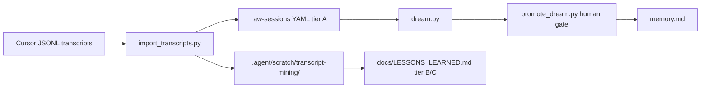

# Agent memory consolidation

**Status:** Shipped (v1, deterministic merge). **Authority for daily use:** [`.agent-memory/CURSOR_USAGE.md`](../../.agent-memory/CURSOR_USAGE.md).

## Purpose

Improve AI coding sessions over time via **external** memory artifacts — not model weight changes. The workflow:

1. **Log** structured session notes (`raw-sessions/`, gitignored by default).
2. **Dream** merge candidates into a proposed `memory.md` + changelog (`dreams/`, gitignored).
3. **Promote** after human review into approved [`.agent-memory/memory.md`](../../.agent-memory/memory.md).

## Layout

| Path | Git | Role |
|------|-----|------|
| `.agent-memory/memory.md` | Tracked | Approved project memory |
| `.agent-memory/schema.md` | Tracked | YAML session + markdown section spec |
| `.agent-memory/config.json` | Tracked | Limits and retention |
| `.agent-memory/raw-sessions/` | Ignored | Per-session YAML logs |
| `.agent-memory/dreams/` | Ignored | Proposals and changelogs |

## Implementation

- Package: [`scripts/agent_memory/`](../../scripts/agent_memory/)
- CLIs: [`scripts/agent-memory/`](../../scripts/agent-memory/)
- Tests: [`tests/test_agent_memory.py`](../../tests/test_agent_memory.py)

## Agent integration

- Rule: `.cursor/rules/agent-memory.mdc` (mirrored `.claude/rules/`)
- Skill: `.cursor/skills/agent-memory/SKILL.md` (mirrored `.claude/skills/`)
- Commands: `/log-session`, `/dream-memory`, `/promote-memory`, `/memory-context`, `/import-transcripts`

## v1 limitations (superseded for transcripts — see v2)

- Consolidation merges explicit `memory_candidates` from session logs (no LLM inside scripts).
- No automatic cross-repo sync with image-scoring-gallery (use per-repo `docs/LESSONS_LEARNED.md`).

## v2 — Cursor transcript import (human-gated)

**Status:** Shipped 2026-06-17. Mines local Cursor `agent-transcripts/*.jsonl` into staging and optional `.agent-memory/raw-sessions/`.

### Flow

### Commands

| Step | Command |
|------|---------|
| Dry-run all repos | `python scripts/agent-memory/import_transcripts.py --dry-run --cursor-projects "%USERPROFILE%\.cursor\projects"` |
| Backend sessions | `python scripts/agent-memory/import_transcripts.py --write-sessions --repo image-scoring-backend` |
| Consolidate + dream | `/dream-memory` then review changelog |
| Promote | `/promote-memory` after human review |

### Config

- [`scripts/transcript_mining/workspace_map.json`](../../scripts/transcript_mining/workspace_map.json) — Cursor workspace → repo names
- [`scripts/transcript_mining/repo_profiles.json`](../../scripts/transcript_mining/repo_profiles.json) — tier A/B/C per repo
- Package: [`scripts/agent_memory/transcripts.py`](../../scripts/agent_memory/transcripts.py)
- Tests: [`tests/test_transcript_mining.py`](../../tests/test_transcript_mining.py)

### Repo tiers

| Tier | Promotion target |
|------|------------------|
| **A** (backend) | `.agent-memory` log → dream → promote |
| **B** (gallery, nwn-modules, …) | `docs/LESSONS_LEARNED.md` + skills |
| **C** (ui, tax, …) | `AGENTS.md` stub + `docs/LESSONS_LEARNED.md` |

### Safety

- UUID dedup across overlapping workspaces (e.g. four image-scoring Cursor roots).
- `secrets.py` scan on all written YAML and candidates.
- Authority stack dedupe against `memory.md`, `CLAUDE.md`, `AGENTS.md`, existing `SKILL.md`.
- Subagent JSONL attached to parent UUID; off-topic chats scored low and skipped.

Slash command: `/import-transcripts`

## Related

- [AGENTS.md](../../AGENTS.md) — slash command index
- [.agent/SAFETY.md](../../.agent/SAFETY.md) — secrets hygiene for memory writes
- [External-tool evaluation](../ai-memory-comparison.md) — why we keep `.agent-memory` over 73 third-party memory tools
